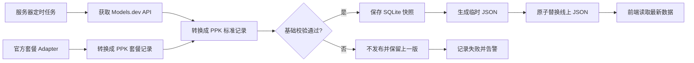

# PPK 数据获取与发布架构 V3

> 状态：已实施并完成正式切换（2026-08-20）。
>
> 本文档同时记录 V3 的设计依据、最终数据链路、部署方式与迁移结果。

## 1. 结论

V3 已从旧版“多个来源共同决定每个字段”的方式，调整为：

1. **Models.dev 是按需计费唯一自动数据源**；
2. **套餐商业信息通过厂商官方页面/API Adapter 自动采集**；
3. **火山引擎暂不纳入 V3 产品范围，不为其建设采集或补充链路**；
4. **一条报价只由一个明确来源负责，不再进行字段级仲裁**；
5. **新数据只有通过基础校验才整体发布，否则继续使用上一次成功版本**；
6. **前端继续读取静态 JSON，不因数据更新重新部署 Web。**

数据源覆盖率已经完成初步实测，详见 [PPK 统一数据源覆盖率审计](./data-source-coverage-audit.md)。原范围下 Models.dev 覆盖 11 个按需计费 Provider 家族中的 10 个；火山引擎暂不纳入产品范围后，Models.dev 对当前范围的 Provider 家族覆盖为 10/10。套餐月费、档位、额度和权益由官方套餐 Adapter 自动获取。

不存在一个公开 API 能可靠覆盖 PPK 的全部数据。更现实的组合是：

| 数据 | 推荐来源 |
|---|---|
| 模型 API / Token 价格 | Models.dev，作为唯一自动来源 |
| ChatGPT、Claude 等通用套餐 | 对应厂商的官方套餐 API/页面 Adapter 自动采集 |
| Cursor、Copilot 等 Coding Plan | 对应厂商的官方套餐 API/页面 Adapter 自动采集；Models.dev 可补充 Endpoint 支持模型 |
| 新范围按需厂商 | Models.dev；第一阶段不维护额外缺失厂商 |
| 汇率 | 独立的轻量汇率来源或固定展示快照 |

## 2. 为什么调整

当前 V2 同时处理：

- LiteLLM；
- OpenRouter；
- 厂商官网 Adapter；
- 人工 YAML；
- 字段级来源优先级；
- 字段级 Last Known Good；
- Drift、Review Queue、Release Gate；
- Alias、Region、Service Tier 等身份推断。

这些能力本身不是错误，但在当前数据规模和维护人力下，产生了几个现实问题：

1. 排障时很难回答“页面上的这个数字究竟为什么是它”；
2. 同名模型可能来自不同渠道、地区和计费层级，字段合并后反而失真；
3. 来源数量越多，冲突和维护成本越高；
4. 官网改版、聚合源别名变化会不断产生特殊规则；
5. 数据源状态数字不能直接说明用户看到的数据是否正确；
6. 开发者必须同时理解采集、身份映射、仲裁、LKG 和审核流程才能修改数据。

近期出现的典型问题包括：

- 厂商直销价格与 OpenRouter 渠道价格被当成同一报价；
- Google Standard、Batch 或 Flex 等服务层级可能被混合；
- Qwen 不同地区、不同部署方式的价格可能使用同一个模型身份；
- `latest` 等浮动别名难以形成稳定历史记录。

V3 的目标不是追求“来源最多”，而是让每条报价的语义明确、更新稳定、维护成本可控。

## 3. V3 的范围

### 3.1 包含

- 按需计费模型目录；
- Input、Output、Cache 价格；
- Context Window、模态等模型元数据；
- Subscription；
- Coding Plan；
- 少量 Developer/API 固定套餐；
- 数据更新历史；
- 运行状态；
- 原子发布；
- 上一次成功版本保留；
- 简单告警。

### 3.2 暂不包含

- 多来源字段级自动仲裁；
- 每个字段独立 LKG；
- 自动判断哪个聚合源更可信；
- 自动合并不同地区、渠道、服务层级的报价；
- 复杂 Review Queue；
- 网页 DOM 变化自动分析；
- 需要人工录入才能完成的日常数据更新；
- Airflow、Kafka、Celery、Kubernetes 等重型组件。

## 4. 数据分类

### 4.1 按需计费

按需计费是模型 API 的实际用量价格，包括：

- Provider；
- Model；
- Input / 1M Tokens；
- Output / 1M Tokens；
- Cache / 1M Tokens；
- Context Window；
- Modalities；
- 原始币种；
- 渠道、地区和服务层级。

它不包含 ChatGPT Plus、Claude Pro、Cursor Pro 等固定套餐。

### 4.2 套餐

套餐继续分为：

- General AI Subscription；
- Coding Tool Plan；
- Developer/API Plan。

套餐没有可靠的统一公共 API，因此采用“每个套餐厂商一个官方 Adapter”的自动采集方式。Adapter 的来源优先级固定为：

1. 厂商公开的官方 JSON/API；
2. 官方定价页中的 JSON-LD、内嵌结构化数据或稳定网络接口；
3. 官方静态 HTML；
4. 只有页面必须执行 JavaScript 时，才使用轻量 Headless Browser。

每个套餐产品只绑定一个官方 Adapter，不同时从多个页面选择价格，因此没有套餐仲裁。Adapter 必须输出产品名、Provider、价格、币种、计费周期、额度/权益、官方来源 URL 和抓取时间。采集失败或结构校验失败时，本次套餐发布失败并继续使用上一份完整成功 Catalog，不允许人工临时填值。

项目不保留需要定期手工编辑的 `plans.yaml`。少量不会频繁变化的映射（例如官方产品 ID 到 PPK Provider ID）可以放在代码配置中，但价格、额度和权益必须来自自动采集结果。

Models.dev 中虽然存在 Coding Plan / Token Plan Provider，但这些记录描述的是 Endpoint 支持的模型，不包含完整套餐档位和月费。V3 可以用可选的 `modelsdev_provider_id` 自动补充支持模型列表，但不能用模型 `cost=0` 推断套餐免费。

## 5. 数据源选择

### 5.1 Models.dev：审计后的推荐主源

[Models.dev](https://github.com/anomalyco/models.dev) 提供公开的模型目录和 JSON API：

```text
https://models.dev/api.json
```

推荐原因：

- 一次请求可以获得统一结构的模型目录；
- 包含价格、Context 和能力等 PPK 所需字段；
- 开源，便于追踪数据变更；
- 接入后可以明显减少 PPK 自己维护的 Source Adapter 数量。

风险：

- 不能假定其覆盖所有国内厂商；
- 不能假定每个价格都是厂商官网直销价格；
- 模型和 Provider 命名需要与 PPK UI 做一次映射；
- 上游错误可能整体影响 PPK。

初步覆盖率审计结果：

- 当前 API 包含 192 个 Provider/渠道入口和 6,840 条 Model Offering；
- PPK 的 11 个按需计费 Provider 家族中覆盖 10 个；
- 唯一明确缺失的目标 Provider 是火山引擎中国区；
- 映射后的 345 条直接 Provider 记录中，336 条有 Input/Output，345 条有 Context，179 条有 Cache Read；
- 无法替代 PPK 当前 49 条套餐。

因此 Models.dev 是 V3 新范围内唯一的自动模型与按需价格来源。官方套餐 Adapter 负责另一类商业产品数据，不是 Models.dev 的备用源。详细数字和其他候选源的研究记录见独立审计文档。

### 5.2 不设置备选主源

V3 运行时不再接入 LiteLLM、OpenRouter 或厂商官网按需价格 Adapter，也不在 Models.dev 失败后切换到另一来源。这样可以保证每条按需报价只有一个明确来源，并删除来源优先级、字段拼接和仲裁代码。

Models.dev 请求失败、返回异常结构或数据量异常时，本次任务直接失败且不发布。线上继续读取“上一份完整成功发布的 Catalog”。这只是发布版本保护，不是备用数据源：旧版本不会与新数据混合，也不会参与字段选择。

LiteLLM、OpenRouter 和旧按需价格官网 Adapter 的研究结论可以保留在审计文档中，但对应运行时代码、配置、Fixture 和状态统计在 V3 切换稳定后删除。新套餐 Adapter 是独立业务链路，不属于这里要删除的按需 Adapter。

## 6. 报价身份

V3 不再把“模型”直接等同于“价格”。当前实现至少区分模型、地区和服务层级，避免把 Standard、Batch 等报价误认为同一条记录。

每条报价使用稳定的 `offer_id`。当前正式运行的 V3 契约为：

```text
provider_id + model_id + region + service_tier
```

示例：

```text
google/gemini-x/global/standard
google/gemini-x/global/batch
qwen/qwen-x/cn/standard
```

这不是仲裁规则，只是在数据层明确区分不同报价。

当前默认值为：

```text
region = global
service_tier = standard
```

Models.dev 已明确标注 Batch、Flex 或中国区时，V3 会写入对应 `service_tier` 或 `region`，不能并入默认报价。更完整的原币、多市场和调用渠道建模暂不属于当前正式契约，统一放到 Phase 5 再开发。

## 7. 数据流



每次运行只做六件事：

1. 获取 Models.dev；
2. 转换字段；
3. 自动采集并加入套餐；
4. 执行基础校验；
5. 保存历史快照；
6. 原子发布前端 JSON。

## 8. 不使用仲裁

V3 只有确定性的两类数据组合：

```text
Models.dev 模型与按需报价
+ 官方套餐 Adapter 输出
= 最终 Catalog
```

规则：

1. Models.dev 负责全部按需计费 `offer_id`；
2. 官方套餐 Adapter 只负责套餐商业信息，不覆盖按需报价；
3. PPK 不提供按需报价 Override，不做字段 Patch；
4. Models.dev 数据确认有误时，优先向上游提交修正；修正发布前继续展示上一份成功 Catalog；
5. 不对多个来源求平均、中位数、投票或自动补齐；
6. 不自动推断不同渠道或地区属于同一报价。

## 9. 套餐 Adapter

套餐 Adapter 按厂商拆分，不建立一个职责过重的通用网页爬虫：

```text
pipeline_v3/sources/plans/
  openai.py
  anthropic.py
  google.py
  github.py
  cursor.py
  kiro.py
  ...
```

所有 Adapter 实现相同接口：`fetch -> parse -> normalize`，输出统一 `PlanRecord`。官方页面结构变化只影响对应厂商。Adapter 返回空列表、关键字段缺失或产品数量异常下降时，校验失败且不发布。

第一批 Adapter 应覆盖当前首页 Featured Plans 和套餐页面的全部厂商；后续新增套餐必须先实现自动 Adapter，不能用人工 YAML 绕过采集流程。

## 10. 校验规则

V3 只保留容易理解、能阻止明显事故的校验。

### 10.1 结构校验

- `offer_id` 唯一；
- Provider 和 Model 非空；
- Currency 和价格单位合法；
- Input、Output 价格不能为负数；
- 缺失 Cache 显示为 `—`，不能变成 0；
- Context 缺失允许发布，但必须保持空值；
- Plan 必须有产品名、Provider、币种和来源 URL；
- 免费套餐必须明确设置 `is_free = 1`，不能仅依靠 `price_amount = 0` 推断。

### 10.2 发布保护

- Models.dev 请求失败：不发布；
- JSON 解析失败：不发布；
- 总报价数量相较上一版下降超过阈值：不发布；
- 重点 Provider 全部消失：不发布；
- 首页依赖的 Featured Plan 或默认 Compare 模型缺失：不发布；
- 输出不符合前端 JSON Schema：不发布。

第一阶段建议：总报价数量下降超过 `20%` 时阻止发布。阈值放在配置文件中，不写死在业务代码里。

### 10.3 不做的校验

- 不因单个价格涨跌 20% 自动冻结字段；
- 不自动比较三个来源并选择“最可信值”；
- 不为每个字段生成 Review；
- 不自动把一个渠道的缺失值从另一个渠道补齐。

价格变化可以进入运行报告，但不阻止发布，除非触发整体规模或结构异常。

## 11. 失败与回退

V3 的回退只有一层：**上一份完整成功发布的 Catalog**。

| 情况 | 行为 |
|---|---|
| Models.dev 超时 | 本次失败，不发布 |
| Models.dev 返回 5xx | 重试后仍失败则不发布 |
| JSON 无法解析 | 不发布 |
| 数据量异常下降 | 不发布 |
| 任一套餐 Adapter 解析或结构校验失败 | 不发布 |
| 写入临时文件失败 | 不替换线上文件 |
| 发布成功 | 新 Catalog 整体替换旧 Catalog |

不再出现“同一条产品中部分字段来自今天、部分字段来自几天前”的复杂状态。

## 12. 存储设计

当前规模继续使用 SQLite，不引入独立数据库服务。

### 12.1 表结构

#### `model_offers`：按需计费模型报价

| 字段 | 类型 | 必填 | 注释 |
|---|---|---:|---|
| `offer_id` | TEXT | 是 | 稳定报价 ID，由 Models.dev Provider、模型、地区和服务层级组成；与 `snapshot_id` 组成联合主键。 |
| `snapshot_id` | TEXT, FK | 是 | 关联本次候选目录 `catalog_snapshots.snapshot_id`，用于历史追踪。 |
| `modelsdev_provider_id` | TEXT | 是 | Models.dev 中的原始 Provider/Endpoint ID。 |
| `provider_id` | TEXT | 是 | PPK 统一 Provider ID，用于前端筛选和 Logo 映射。 |
| `provider_name` | TEXT | 是 | 面向用户展示的厂商名称。 |
| `model_id` | TEXT | 是 | Models.dev 原始模型 ID，不使用浮动展示名作为主键。 |
| `model_name` | TEXT | 是 | 面向用户展示的模型名称。 |
| `region` | TEXT | 是 | 当前报价地区，例如 `cn` 或 `global`；上游未区分时为 `global`。 |
| `service_tier` | TEXT | 是 | 服务层级，例如 `standard`、`batch` 或 `flex`。 |
| `currency` | TEXT | 是 | 原始报价币种，例如 `USD`、`CNY`。 |
| `price_unit` | TEXT | 是 | 价格单位；当前统一为 `per_1m_tokens`。 |
| `input_per_1m` | REAL | 否 | 每 100 万 Input Tokens 价格；缺失时为空，不能写 0。 |
| `output_per_1m` | REAL | 否 | 每 100 万 Output Tokens 价格；缺失时为空，不能写 0。 |
| `cache_read_per_1m` | REAL | 否 | 每 100 万缓存读取 Tokens 价格；缺失时为空。 |
| `cache_write_per_1m` | REAL | 否 | 每 100 万缓存写入 Tokens 价格；缺失时为空。 |
| `context_window` | INTEGER | 否 | 最大上下文 Token 数；Models.dev 未提供时为空。 |
| `max_output_tokens` | INTEGER | 否 | 最大输出 Token 数；上游未提供时为空。 |
| `modalities_json` | TEXT | 否 | 模型支持的输入/输出模态 JSON，例如文本、图像、音频。 |
| `knowledge_cutoff` | TEXT | 否 | Models.dev 提供的知识截止日期；没有时为空。 |
| `source_url` | TEXT | 是 | 对应 Models.dev 数据或文档地址，用于追溯。 |
| `source_updated_at` | TEXT | 否 | 上游记录的更新时间；上游没有时为空。 |
| `fetched_at` | TEXT | 是 | PPK 本次抓取到该报价的 UTC 时间。 |
| `raw_json` | TEXT | 是 | 该报价对应的原始上游片段，便于排障但不直接供前端使用。 |

#### `plans`：订阅制、Coding Plan 与 Developer/API 套餐

| 字段 | 类型 | 必填 | 注释 |
|---|---|---:|---|
| `plan_id` | TEXT | 是 | 稳定套餐 ID，格式建议为 `provider/product/tier`；与 `snapshot_id` 组成联合主键。 |
| `snapshot_id` | TEXT, FK | 是 | 关联本次候选目录 `catalog_snapshots.snapshot_id`。 |
| `provider_id` | TEXT | 是 | PPK 统一 Provider ID。 |
| `provider_name` | TEXT | 是 | 面向用户展示的厂商名称。 |
| `product_name` | TEXT | 是 | 产品或套餐名称，例如 `ChatGPT Plus`。 |
| `plan_category` | TEXT | 是 | `general_ai`、`coding_tool` 或 `developer_api`。 |
| `billing_type` | TEXT | 是 | 兼容现有 UI 的 `subscription` 或 `coding_plan`。 |
| `is_free` | INTEGER | 是 | 是否为官方免费档；SQLite 使用 `0/1`。 |
| `price_amount` | REAL | 否 | 当前计费周期的原始价格；免费档可以为 0，未知必须为空。 |
| `currency` | TEXT | 是 | 官方标价币种。 |
| `billing_cadence` | TEXT | 是 | `monthly`、`yearly`、`one_time`、`credit_based` 等官方计费周期。 |
| `monthly_equivalent` | REAL | 否 | 为 UI 比较计算的月度等价值；不能覆盖原始价格。 |
| `first_period_price` | REAL | 否 | 官方明确存在首期优惠时记录；没有时为空。 |
| `included_quota` | REAL | 否 | 官方明确给出的额度数值；不限量或未知时为空。 |
| `quota_unit` | TEXT | 否 | 额度单位，例如 `requests`、`credits`、`tokens`。 |
| `quota_period` | TEXT | 否 | 额度重置周期，例如 `month`、`day` 或 `5_hours`。 |
| `features_json` | TEXT | 否 | 官方列出的主要权益数组 JSON，不做营销文案推断。 |
| `supported_models_json` | TEXT | 否 | Adapter 或 Models.dev 能确认的支持模型 ID 数组。 |
| `purchase_url` | TEXT | 否 | 官方购买/订阅入口；官方未提供直达链接时为空。 |
| `source_url` | TEXT | 是 | 官方 API、定价页、帮助文档或公告 URL。 |
| `source_kind` | TEXT | 是 | `official_api`、`structured_page`、`html` 或 `headless_page`。 |
| `source_updated_at` | TEXT | 否 | 官方页面/API 提供的更新时间；没有时为空。 |
| `fetched_at` | TEXT | 是 | PPK 自动采集时间。 |
| `content_checksum` | TEXT | 是 | 参与标准化的官方内容 SHA-256，用于变化检测。 |
| `raw_json` | TEXT | 是 | Adapter 标准化前的原始套餐片段。 |

`model_offers` 与 `plans` 都按 `snapshot_id` 保留版本数据。新 Release 发布后，前端读取对应 Snapshot；采集失败不会把旧行和新行拼在一起。

#### `pipeline_runs`：一次 Pipeline 执行记录

| 字段 | 类型 | 必填 | 注释 |
|---|---|---:|---|
| `run_id` | TEXT, PK | 是 | 本次运行的唯一 ID，建议使用 UUID。 |
| `started_at` | TEXT | 是 | 运行开始时间，使用 UTC ISO 8601。 |
| `finished_at` | TEXT | 否 | 运行结束时间；任务仍在运行时为空。 |
| `status` | TEXT | 是 | 运行状态：`running`、`succeeded`、`failed` 或 `published`。 |
| `source` | TEXT | 是 | 本次运行 Profile，例如 `catalog`、`plans` 或 `full`。 |
| `source_http_status` | INTEGER | 否 | 主请求 HTTP 状态码；多 Adapter 运行的详细状态记录在 `source_snapshots`。 |
| `record_count` | INTEGER | 否 | 标准化后按需报价记录数。 |
| `plan_count` | INTEGER | 否 | 本次由官方 Adapter 自动采集并通过校验的套餐数。 |
| `published_release_id` | TEXT | 否 | 本次运行最终发布的 Release ID；未发布时为空。 |
| `error_code` | TEXT | 否 | 机器可识别的错误码，例如 `SOURCE_TIMEOUT`。 |
| `error_message` | TEXT | 否 | 供运维排障阅读的错误摘要，不存完整堆栈。 |
| `summary_json` | TEXT | 否 | 本次新增、删除、变化数量等运行摘要 JSON。 |

#### `source_snapshots`：Models.dev 与官方套餐 Adapter 原始响应留档

| 字段 | 类型 | 必填 | 注释 |
|---|---|---:|---|
| `source_snapshot_id` | TEXT, PK | 是 | 原始快照唯一 ID。 |
| `run_id` | TEXT, FK | 是 | 关联 `pipeline_runs.run_id`。 |
| `source` | TEXT | 是 | 来源标识，例如 `models_dev`、`openai_plans`、`cursor_plans`。 |
| `fetched_at` | TEXT | 是 | 成功收到响应的 UTC 时间。 |
| `source_url` | TEXT | 是 | 实际请求地址，便于追溯。 |
| `http_status` | INTEGER | 是 | HTTP 响应状态码。 |
| `etag` | TEXT | 否 | 上游返回的 ETag；没有时为空。 |
| `last_modified` | TEXT | 否 | 上游返回的 Last-Modified；没有时为空。 |
| `checksum` | TEXT | 是 | 原始响应内容的 SHA-256，用于确认内容是否变化。 |
| `byte_size` | INTEGER | 是 | 原始响应字节数，用于发现异常空响应或突降。 |
| `raw_path` | TEXT | 是 | 压缩原始 JSON 在磁盘中的相对路径。 |

#### `catalog_snapshots`：标准化并合并自动套餐后的候选目录

| 字段 | 类型 | 必填 | 注释 |
|---|---|---:|---|
| `snapshot_id` | TEXT, PK | 是 | 候选 Catalog 快照唯一 ID。 |
| `run_id` | TEXT, FK | 是 | 关联生成它的 `pipeline_runs.run_id`。 |
| `created_at` | TEXT | 是 | 候选快照生成时间。 |
| `schema_version` | TEXT | 是 | Catalog Schema 版本，用于前端契约兼容。 |
| `checksum` | TEXT | 是 | 标准化 Catalog 内容的 SHA-256。 |
| `provider_count` | INTEGER | 是 | 候选目录中的 Provider 数量。 |
| `model_count` | INTEGER | 是 | 候选目录中的按需模型/报价数量。 |
| `plan_count` | INTEGER | 是 | 候选目录中由官方 Adapter 自动采集的套餐数量。 |
| `catalog_json` | TEXT | 是 | 完整候选 Catalog JSON；当前规模允许直接存 SQLite。 |

#### `releases`：已经通过校验、可供前端读取的发布版本

| 字段 | 类型 | 必填 | 注释 |
|---|---|---:|---|
| `release_id` | TEXT, PK | 是 | 发布版本唯一 ID。 |
| `snapshot_id` | TEXT, FK | 是 | 关联已通过校验的 `catalog_snapshots.snapshot_id`。 |
| `created_at` | TEXT | 是 | Release 记录创建时间。 |
| `published_at` | TEXT | 否 | 原子切换到线上 `public/` 的时间；未发布时为空。 |
| `status` | TEXT | 是 | `prepared`、`published` 或 `superseded`。 |
| `checksum` | TEXT | 是 | 发布文件 SHA-256，供前端服务与运维核验。 |
| `catalog_path` | TEXT | 是 | 不可变 Release Catalog 文件路径。 |
| `status_path` | TEXT | 是 | 对应运行状态与更新时间文件路径。 |

V3 不创建 `observations`、`decisions`、`accepted_baselines` 等仲裁表。`model_offers` 和 `plans` 保存业务数据，其余四张表回答：任务是否成功、原始数据是什么、生成了哪个候选版本、线上发布的是哪个版本。

### 12.2 文件目录

```text
runtime/
  ppk.db
  raw/
    <run-id>/models-dev.json.gz
    <run-id>/plans/<adapter-id>.json.gz
  releases/
    <release-id>/catalog.json
    <release-id>/status.json
  public/catalog.json
  public/status.json
  pipeline.lock
```

原始响应保存一段有限时间，例如 30 天；成功 Release 保存最近 30～90 个版本。

## 13. 前端发布契约

“发布契约”在这里仅表示：Pipeline 最终生成给前端读取的 JSON 格式。当前前端直接读取 V3 Catalog，不再存在旧 Schema Exporter。

```text
V3 model_offers + plans
    ↓ 完整校验与原子发布
runtime/public/catalog.json
    ↓
Nginx /data/catalog.json
    ↓
Vue UI 网络边界适配
```

## 14. 调度

调度继续由服务器负责，Pipeline 自身一次运行后退出。

建议：

| 任务 | 频率 | 内容 |
|---|---|---|
| Catalog 更新 | 每日 2 次 | 获取 Models.dev、运行全部套餐 Adapter、校验、发布 |
| 套餐结构巡检 | 每日 2 次（随 Catalog） | 检查官方套餐页面结构、产品数量和关键字段是否异常 |
| 历史清理 | 每周 1 次 | 删除过期 raw，保留 Release |

当前每日 4 次可以继续使用，但模型价格通常不需要四次抓取。正式频率可在主源稳定性审计后决定。

示例 systemd 调用：

```bash
docker compose --profile pipeline run --rm pipeline \
  python3 -m scripts.pipeline_v3.cli run
```

数据更新不执行 Git Commit、Git Push、Web 重建或 Nginx 重启。

## 15. 状态与告警

公开页面只展示用户能理解的信息：

- 最近成功更新时间；
- 当前 Catalog 是否可用；
- 已收录 Provider 和报价数量。

不建议继续用 `12/15 数据源正常` 作为主要公开指标，因为它无法说明：

- 哪三个来源异常；
- 异常来源是否影响线上数据；
- 一个来源是否只是补充来源；
- 用户看到的报价是否仍然完整。

### 15.1 首页“价格数据，有迹可循”同步调整

V3 不再宣传“三源交叉验证”，首页也不再展示 `12/15` 这类多数据源健康比例。建议保留现有模块布局，只替换语义：

| 位置 | 当前表达 | V3 建议表达 |
|---|---|---|
| Eyebrow | `OPEN DATA · TRACEABLE` | `DATA STATUS · UPDATED` |
| 标题 | `价格数据，有迹可循` | `价格数据，来源明确` |
| 说明 | LiteLLM、OpenRouter 与厂商官网三源交叉验证 | 按需价格来自 Models.dev；套餐由厂商官方页面/API 自动更新。更新失败时继续展示最近一次成功发布的完整版本。 |
| 指标一 | `12/15 数据源状态正常` | 动态展示当前 Catalog 收录的 Provider 数量 |
| 指标二 | 最近一次数据更新 | 保留，读取 Release 的 `published_at` |
| 指标三 | Open Source | 保留，继续链接代码与数据说明 |

公开页面表达的是“当前数据来自哪里、何时更新、是否可用”，不再表达来源仲裁、交叉验证或可信度评分。内部运维页再展示 Models.dev 请求状态、校验结果和发布失败原因。

### 15.2 `/about` 关于页面同步改造

当前 `/ui/#/about` 仍描述 LiteLLM、OpenRouter、官网爬虫、人工 YAML、多源仲裁、字段级置信度和 Last Known Good。这些内容在 V3 完成后全部失效，必须与 Pipeline 同批更新，不能继续向用户展示旧架构。

#### 项目简介

建议替换为：

> PPK（Price Per Token）是一个非商业的 AI 模型与套餐价格工具，帮助开发者查看和比较按需 Token/API 价格、通用 AI 订阅与 Coding Plan。按需模型和价格由 Pipeline 从 Models.dev 自动同步；套餐价格与权益由各厂商官方 API 或定价页面 Adapter 自动采集。所有数据经过结构、数量和前端契约校验后，以完整版本原子发布。任一关键采集或校验失败时，本次版本不会上线，页面继续读取最近一次成功发布的完整数据。

这里删除“多源仲裁”以及“单厂商失败不影响其他厂商展示”的说法。V3 采用完整 Release 发布，失败时不会把部分新数据与部分旧数据拼接。

#### 数据来源

保留现有动态 Provider 列表，但在列表上方明确区分两类来源：

| 数据类别 | `/about` 应展示的来源 |
|---|---|
| 按需计费、模型能力、Context、模态 | Models.dev |
| Subscription、Coding Plan、Developer/API 套餐 | 对应厂商官方 API、定价页、帮助文档或公告，由套餐 Adapter 自动采集 |

Provider Logo 列表表达“PPK 当前收录哪些厂商”，不再表达“系统存在多少个互相验证的数据源”。火山引擎暂不在当前收录范围中。

#### 采集流程

删除当前 L1/L2/L3/M 四层列表，替换为以下四步：

1. **自动获取**：Models.dev 获取按需模型数据；官方套餐 Adapter 获取套餐商业信息。
2. **统一格式**：分别转换为 `model_offers` 与 `plans` 标准记录。
3. **校验与快照**：检查必填字段、价格单位、产品数量和前端数据契约，并保存原始响应与 SQLite Snapshot。
4. **原子发布**：完整候选版本通过后生成 JSON 并一次性切换；失败则保留上一份成功 Release。

页面不再出现：

- LiteLLM 主源；
- OpenRouter 交叉验证；
- 官网按需价格补充；
- YAML 人工套餐；
- high / medium / low / manual 置信度；
- 字段级仲裁或字段级 LKG。

#### 历史追溯

建议替换为：

> 每次任务、Models.dev 与套餐 Adapter 原始响应、标准化按需报价、套餐记录、候选 Snapshot 和正式 Release 都写入 SQLite 或对应的不可变快照文件。发布文件通过原子替换切换，失败任务不会覆盖线上版本。

不再声称保存字段级 Observation、Decision 或置信度，因为这些 V2 表会被删除。

#### 技术栈

V3 完成后展示：

| 类别 | `/about` 应展示的技术栈 |
|---|---|
| 数据采集 | Python；Models.dev HTTP Source；厂商官方套餐 Adapter；Headless Browser 仅作为动态页面的最后手段 |
| 数据处理 | 确定性 Normalize、Schema Validation、Change Detection，不包含多源仲裁 |
| 数据存储 | SQLite（`model_offers`、`plans`、运行、快照、Release）+ 不可变 Raw/Release JSON |
| 前端 | Vue 3 CDN + 当前字体系统，读取 `/ui-data/catalog.json` |
| 调度与部署 | systemd timer + Docker Compose；数据更新不依赖 Git Push、Web 重建或 Nginx 重启 |
| 告警 | 飞书 Webhook，报告采集失败、页面结构变化、校验阻断和发布超时 |

#### 上线顺序

1. V3 离线数据与 UI 契约测试通过；
2. 更新首页可信度模块和 `/about` 文案；
3. 前端切换到 `/ui-data/catalog.json`；
4. 验证首页、按需计费、Compare、套餐、Provider 和 About；
5. 删除 V1/V2 数据代码、旧公开路径和旧架构文案。

验收测试必须检查 `/about` 页面源码和渲染结果中不再出现 `LiteLLM`、`OpenRouter`、`三源交叉验证`、`多源仲裁`、`人工补充` 或旧 V1/V2 路径。

内部状态应包含：

- 本次任务成功/失败；
- Models.dev 与各套餐 Adapter 的 HTTP 状态和耗时；
- 新旧记录数量；
- 新增、删除、变化数量；
- 是否发布；
- 失败原因。

基础告警只需要：

- 连续两次任务失败；
- 超过 24 小时没有成功发布；
- 数据量异常下降；
- 套餐 Adapter 解析或结构校验失败；
- 磁盘或数据库写入失败。

## 16. 后期管理后台

管理后台不是 V3 核心链路依赖，但数据结构应允许后续增加。

最小后台功能：

- 查看最近 Pipeline Runs；
- 查看本次新增、删除和价格变化；
- 查看 Models.dev 与上一版 Catalog 的变化；
- 查看套餐 Adapter 状态与原始快照；
- 手工触发更新；
- 选择历史 Release 回滚。

后台只提供状态、历史和手工重跑，不提供直接修改价格功能。修复套餐数据应修改对应 Adapter 或映射配置，再重新运行 Pipeline；后台不直接编辑线上 `catalog.json`。

## 17. 分阶段实施

### 当前实施状态（2026-08-20）

- Phase 0 覆盖率审计：已完成；
- Phase 1 Models.dev、V3 SQLite、快照、校验、原子发布基础：已完成；
- Phase 1 套餐 Adapter：已建立静态 HTTP / 动态浏览器两种 Fetcher、统一解析接口、逐源探测命令、原始响应留档和发布失败保护；Anthropic、Cursor、GitHub Copilot、Kiro、Google、OpenAI ChatGPT Plus、OpenCode、智谱、阿里百炼 Token Plan、MiniMax 共 12 个稳定官方来源已通过实测，当前可自动生成 33 条套餐记录；
- OpenAI 的地区化 ChatGPT Pricing 页面仍不作为正式来源；ChatGPT Plus 改由明确公开 `$20/month` 的 OpenAI Help Center 页面自动采集。Kimi 公开页未返回价格正文；小米页面要求登录；Cursor Hobby 独立价格页无法稳定提供可解析标记。这些来源尚未满足“无人值守、仅使用官方信息”的入库条件，只进入独立探针，不阻断稳定来源的候选生成，也不使用人工价格兜底；
- Phase 2 双轨验证：已完成一次真实宿主机和 Docker 候选验证；根据当前站点低流量决策，不再等待一至两周；
- Phase 3 正式切换：已完成。前端读取 `/data/catalog.json`，V3 每日两次正式发布；
- Phase 4 清理：已完成。V1/V2 Pipeline、旧 Source、人工 YAML、旧 Schema、旧测试、旧 systemd 和候选比较代码均已从主代码树删除；
- Phase 5 原币、多市场报价扩展：待开发，不属于当前正式运行的 V3 Catalog 契约。

当前 CLI 默认运行已实现的套餐 Adapter，并受 `PPK_MINIMUM_PLAN_COUNT` 保护。迁移排查时可用 `--models-only --dry-run` 单独验证 Models.dev，但该模式不能用于正式发布。

套餐来源可使用 `python3 -m scripts.pipeline_v3.cli probe-plans` 独立探测。该命令会检查完所有 Adapter 后统一报告成功与失败来源、HTTP 状态、耗时和解析出的套餐名称，不发布数据，也不会覆盖上一份成功 Catalog。

### Phase 0：覆盖率审计

不修改线上链路，只生成报告：

- Models.dev Provider 覆盖；
- V3 新范围内 10 个重点 Provider 覆盖；
- 当前模型可匹配率；
- Input、Output、Cache、Context 字段覆盖率；
- 国内厂商缺失清单；
- 渠道、地区、服务层级识别情况；
- 与当前线上 Catalog 的价格差异。

输出建议：

```text
runtime/audit/models-dev-coverage.json
runtime/audit/models-dev-coverage.md
```

### Phase 1：离线 V3

- 实现 Models.dev Source；
- 实现标准化记录；
- 实现当前套餐厂商的官方 Adapter；
- 实现 `model_offers`、`plans` 及运行/快照/发布表；
- 实现基础校验；
- 生成离线 Catalog；
- 不覆盖线上文件。

### Phase 2：双轨验证（已完成）

- V2 继续服务线上；
- V3 按计划运行并生成候选文件，不写入 V2 正式目录；
- 原计划观察一至两周；当前因网站访问量很低，经确认改为完成一次真实容器验证后立即切换；
- 修复身份、渠道和覆盖缺口；
- 前端契约测试必须通过。

切换前使用过以下隔离目录，现已删除：

```text
runtime/public/v2/catalog.json                 # V2 正式数据，Web 继续读取
runtime/public/v2/status.json                  # V2 正式状态
runtime/public/v3-candidate/catalog.json       # V3 候选数据，不供现网 UI 使用
runtime/public/v3-candidate/status.json        # V3 候选运行状态
runtime/public/v3-candidate/comparison.json    # 最新一次 V2 与 V3 数量差异
runtime/v3/ppk.db                              # V3 每次运行、快照与候选历史
runtime/v3/raw/<run_id>/                       # Models.dev 与官方页面原始响应
```

正式运行使用 `ppk-data-pipeline.timer` 和 Compose `pipeline` 服务。候选目录、比较代码与 V2 路径不再属于当前运行架构。

首次真实候选结果（2026-08-20）为 14 个模型 Provider、336 条模型报价、32 条套餐；正式切换后补充 OpenAI Help Center 的 ChatGPT Plus 自动采集，当前正式结果为 336 条模型报价、33 条套餐、12 个套餐自动来源。这里的模型数量口径与 V2 不同：V2 混合并展开了多个来源/渠道记录，V3 仅保留 Models.dev 在当前产品范围内的标准化 Offer，因此不能仅凭总数判断缺失。

### Phase 3：切换发布（已完成）

- 停止 V2 定时任务；
- V3 直接发布正式 `/data/catalog.json` 与 `/data/status.json`；
- 同步更新首页数据可信度模块、FAQ 数据来源表述和 `/about` 页面；
- 验证调度、状态、页面数据和 Release 回滚。

### Phase 4：完成 V3 并彻底删除 V1/V2（已完成）

V3 验收通过后直接删除，不归档在主代码树中：

- 字段级 reconcile；
- field observations / decisions；
- accepted baselines；
- Review Queue；
- LiteLLM Source、配置、Fixture 与状态统计；
- OpenRouter Source、配置、Fixture 与状态统计；
- 所有按需价格官网 Adapter 及其专用解析代码；
- V1、V2 Pipeline 目录、CLI、配置、Fixture 和测试；
- V1、V2 SQLite 数据库与 Runtime 目录；
- V1、V2 Docker Compose Service、Cron/systemd 配置和 Workflow 步骤；
- `/ui-data/v1`、`/ui-data/v2` 输出与前端兼容读取逻辑；
- 仅为旧 Schema 服务的 Exporter 和迁移脚本。

删除前必须确认 V3 已覆盖前端、调度、状态、手工执行和 V3 Release 回滚。删除完成后，仓库只保留 V3 实现；历史代码由 Git 历史查询，不在仓库中保留 `legacy/` 或归档副本。

### Phase 5：逐步增强

按真实需求选择：

1. 原币与多市场报价扩展；
2. 补充国内厂商的官方人民币报价；
3. 增加简单管理后台；
4. 增加价格变化订阅；
5. 增加渠道价格展示。

#### Phase 5.1：原币与多市场报价扩展（待开发）

这一项是未来增强，不是当前 V3 已实现能力。开发时再将报价身份从当前的 `provider_id + model_id + region + service_tier` 扩展为：

```text
provider_id + model_id + market + access_channel + service_tier
```

其中：

- `provider_origin` 只表示厂商来源地；
- `market` 表示报价适用市场，例如中国大陆、国际或新加坡；
- `access_channel` 表示调用或购买渠道，例如厂商官方 API、AWS Bedrock 或 Azure AI；
- `currency` 保存该市场官方报价的原始币种。

扩展后的原则是：国外厂商国际报价显示 USD，国内厂商中国大陆报价显示 CNY，同一国内厂商的国际站报价可以另存为 USD；PPK 不做隐式汇率换算。排序、最低价高亮和横向比较只在相同币种内进行，混合币种时明确提示不可直接比较。国内官方 CNY 数据源按厂商逐步增加，不与 Models.dev 当前报价进行字段级仲裁。

不因为“以后可能需要”提前恢复复杂仲裁。

## 18. 测试要求

至少覆盖：

1. Models.dev 正常返回；
2. Models.dev 请求失败时不发布；
3. JSON 格式错误时不发布；
4. 数据量异常下降时不发布；
5. 套餐 Adapter 请求失败时不发布；
6. 套餐页面结构变化、关键字段缺失或产品数量异常下降时不发布；
7. Plan 数据校验及官方来源追溯；
8. Cache 缺失不会变成 0；
9. 同一 Snapshot 内重复 `offer_id` 或 `plan_id` 被拒绝；
10. JSON 原子发布；
11. 失败时继续保留上一版；
12. 迁移期 Exporter 满足现有 UI Contract；
13. 首页、按需计费、Compare、套餐页面能加载候选数据；
14. 首页状态模块不再输出多源健康比例或仲裁文案；
15. `/about` 不再展示 LiteLLM、OpenRouter、人工 YAML、多源仲裁和字段级 LKG；
16. V3 完成后仓库、部署配置与公开路径中不存在 V1/V2 残留。

## 19. 已确认的实施决策

以下决策已经确认，并作为当前 V3 实现约束：

1. 是否同意取消多来源字段级仲裁；
2. 是否确认火山引擎暂不纳入产品范围，并将 Models.dev 作为当前范围唯一按需主源；
3. 是否接受“按需计费由 Models.dev 自动获取、套餐由官方 Adapter 自动获取”；
4. 是否确认 V3 不设置 LiteLLM、OpenRouter 或按需价格官网 Adapter 作为备选数据源；
5. 是否仅在迁移期保留当前前端 JSON Schema，V3 完成后删除 V1/V2 兼容层；
6. Catalog 更新频率选择每日 2 次还是继续每日 4 次；
7. 数据量下降阻断阈值是否采用 20%；
8. 是否确认按需报价不提供本地 Override，上游问题通过 Models.dev 修复；
9. 是否确认 Phase 0 审计已经完成，Models.dev 为最终唯一自动主源；
10. V3 稳定后是否直接删除 V1/V2 全部代码、数据库、部署配置与输出路径。

## 20. 推荐决策

建议批准以下组合：

```text
唯一自动主源   Models.dev
按需计费       Models.dev；火山引擎暂不纳入产品范围
套餐           各厂商官方 API/页面 Adapter 自动采集；Models.dev 可补充支持模型
按需修正       PPK 不设 Override，向 Models.dev 上游修复
OpenRouter     删除运行时 Source 与相关代码
LiteLLM        删除运行时 Source 与相关代码
官网 Adapter   删除旧按需价格 Adapter；新建职责单一的官方套餐 Adapter
数据库         SQLite
前端输出       迁移期兼容旧契约，V3 完成后只保留 /ui-data/catalog.json
调度           systemd timer / 服务器 Cron
发布失败回退   上一份完整成功 Catalog
第一步         Phase 1 离线实现（Phase 0 审计已完成）
```

这套方案优先保证：容易理解、容易排障、不会错误混合报价，并允许后续按真实需求逐步增强。
