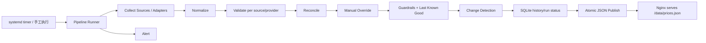

# PPK 数据 Pipeline

本文档描述 PPK 价格数据链路的旧架构审计、目标架构、运行方式和迁移过程。前端数据契约在本阶段保持兼容：仍通过 `GET /data/prices.json` 消费数据。

## 1. 旧架构

旧入口是 `scripts/run_daily.py`。一次运行依次抓取 LiteLLM、OpenRouter 和官网 Adapter，按 Provider 仲裁，合并 `data/manual/*.yaml`，写 SQLite 历史，直接覆盖 `data/prices.json`，更新 `run_status.json`，提交并推送 Git，最后发送飞书告警。

调度器位于 Docker 镜像内部：Dockerfile 安装 cron，并在镜像构建时写入固定时间表。数据提交触发 GitHub Actions，随后重新部署 GitHub Pages，并通过 SSH 重建服务器容器。

```text
container cron
  -> run_daily.py
     -> fetch + normalize + reconcile + validate
     -> SQLite history
     -> overwrite prices.json
     -> git commit/push
        -> GitHub Pages deploy
        -> server image rebuild
```

## 2. 旧架构问题

1. `run_daily.py` 同时负责采集、业务规则、持久化、发布、Git 和告警，职责过重，单元测试只能大量 patch 全局函数。
2. cron 被烘焙进镜像；变更时间表需要重建镜像，容器还必须常驻运行 cron。
3. 数据发布依赖 Git commit/push，数据更新会触发 CI/CD 和应用重建。
4. scraper 容器没有持久化 `data/prices.db`，SQLite 历史会随容器重建丢失。
5. scraper 写容器内 `/app/data`，Web 却挂载宿主机 `./data`；两者并不可靠共享实时结果。
6. JSON 使用普通覆盖写；进程中断时可能产生空文件或半写文件。
7. 全局校验只检查顶层结构和重复 Provider ID，不能阻止产品骤减、空 Provider、价格字段缺失等异常。
8. Provider 快照在候选数据最终通过前提交，失败运行可能留下部分历史；同日 `REPLACE` 也抹掉运行粒度。
9. Source 失败被折叠为空字典，无法区分失败、无覆盖和正常空结果。
10. sources-only Provider 失败没有统一状态；`last_push_at` 也不能真实表达发布结果。
11. Git 凭证进入采集容器，扩大了权限和故障面。

## 3. 新架构

新实现是一个由运行环境按时调用的短生命周期单进程 Pipeline。它不常驻、不管理定时器、不调用 Git，也不触发部署。



### 模块边界

| 模块 | 职责 |
|---|---|
| Scheduler | 服务器 systemd timer；只负责何时执行 |
| Source / Adapter | 从单一外部来源读取原始数据 |
| Collect | 隔离单 Source / Provider 错误并记录结果 |
| Normalize | 将 `Product` 转成兼容字典，统一 Provider 元数据和购买链接 |
| Validate | 校验产品字段、Provider 完整性和 Dataset 基本结构 |
| Reconcile | 复用现有多源价格仲裁，不做存储或发布 |
| Overrides | 以 `data/manual/*.yaml` 为显式人工覆盖层 |
| Guardrails | 检测 Provider/产品数量骤降和异常价格变化；失败时使用 LKG |
| Storage | SQLite 持久化 raw fetch、run/source/provider 状态、发布版本和价格历史 |
| History / Change Detection | 纯函数比较旧发布版本与新候选版本，发布成功后记录变化 |
| Publish | 临时文件 + fsync + `os.replace` 原子替换 JSON |
| Alert | 在运行结束后汇总发送，不参与发布事务 |
| Run Status | SQLite 为权威状态；原子写 `run_status.json` 作为便捷观测文件 |

## 4. 目录结构

```text
scripts/
  pipeline/
    cli.py              # run/status 命令入口
    config.py           # 路径和阈值配置
    collector.py        # Source/Adapter 隔离采集
    normalize.py        # Provider 构造、manual merge、URL 统一
    guardrails.py       # 校验、骤降保护、Provider LKG
    changes.py          # 纯变更检测
    alerts.py           # 告警投递与可观测结果
    storage.py          # SQLite run/release/status repository
    publisher.py        # 原子 JSON/status 发布
    runner.py           # 仅编排各阶段
ops/systemd/
  ppk-data-pipeline.service
  ppk-data-pipeline.timer
```

旧 `scripts/run_daily.py` 保留为一个兼容入口，只转调新 CLI；不再包含 Git 或业务编排。

## 5. 数据源策略

- LiteLLM、OpenRouter 和官网 Adapter 独立采集，任一 Source 失败不会终止其他 Source。
- 每个结果记录 `success / failed / empty`、耗时、产品数和错误。
- Reconcile 继续复用现有 product-id 对齐和置信度策略。
- Manual YAML 是显式 Override：同 Provider、同 Product ID 时覆盖自动来源；未命中的手工产品作为补充。
- Source 返回空不会被解释为“删除全部数据”；Guardrails 会与 LKG 比较并按 Provider 阻断。

## 6. 数据持久化

SQLite 文件默认位于 `/var/lib/ppk/prices.db`（本地默认 `runtime/prices.db`），通过 Docker volume/宿主目录持久化。它保存：

- 每次 Pipeline run；
- 每个 Source 和 Provider 的运行状态；
- 原始抓取数据；
- 发布版本及完整 JSON payload（Last Known Good）；
- 被接受版本的产品快照和价格变化。

SQLite 是审计与历史的权威存储；`data/prices.json` 是实际服务边界，也是 SQLite 发布元数据异常时的 LKG 恢复来源。它不再承担完整历史存储职责。

## 7. 校验、错误处理与降级

1. 单 Source 失败：记录失败，继续其他 Source。
2. 单 Adapter/Provider 失败：使用该 Provider 的 LKG，并在 `provider_status` 标记 stale。
3. 产品数量骤降：与该 Provider LKG 比较；低于阈值时阻断该 Provider 候选。
4. 全局数量骤降：在 Provider fallback 后再次比较；失败则整次不发布。
5. 价格异常：复用 20% warning / 50% block 语义；block 时回退 Provider LKG。
6. 字段缺失：候选 Provider 校验失败并回退，不允许污染发布文件。
7. 首次运行没有 LKG：只有完整通过校验的 Provider 可以进入候选；Dataset 未达到最小规模时拒绝发布。
8. 告警失败：只记录告警发送状态，不回滚已成功的原子发布。

## 8. 原子发布

Pipeline 在目标目录创建临时文件，完整写入 JSON，执行 flush/fsync，再用同文件系统上的 `os.replace` 原子替换 `data/prices.json`。Nginx 始终读取旧完整文件或新完整文件，不会读取半写内容。

发布不执行 Git，不重启 Nginx，也不重建容器。Compose 中 Pipeline 与 Web 共享宿主机 `./data`；新文件替换后下一次 HTTP 请求立即读取新数据。

GitHub Pages 构建仍可携带仓库中的静态快照，但不作为实时数据发布通道；实时站点应使用上述共享 volume 的 Nginx，或未来将相同原子发布接口替换为对象存储。这样不会重新引入“数据更新触发代码部署”的耦合。

## 9. 调度与部署

推荐使用服务器 systemd：

```bash
sudo cp ops/systemd/ppk-data-pipeline.* /etc/systemd/system/
sudo systemctl daemon-reload
sudo systemctl enable --now ppk-data-pipeline.timer
systemctl list-timers ppk-data-pipeline.timer
```

Timer 调用一次性任务：

```bash
docker compose --profile pipeline run --rm pipeline run
```

调整时间只修改 systemd timer，不需要修改采集代码或重建 Web。Dockerfile 不安装 cron/Git，`entrypoint.sh` 不再常驻守护进程。

## 10. 手工执行与状态

本地：

```bash
python3 -m scripts.pipeline.cli run
python3 -m scripts.pipeline.cli status
python3 scripts/query_history.py stats
```

服务器：

```bash
docker compose --profile pipeline run --rm pipeline run
docker compose --profile pipeline run --rm pipeline status
journalctl -u ppk-data-pipeline.service -n 200 --no-pager
```

`status` 显示最近运行、发布版本、Source/Provider 状态和错误；详细原始数据与价格历史仍可通过 `query_history.py` 查询。

## 11. 故障排查

| 现象 | 检查 |
|---|---|
| Timer 未运行 | `systemctl status ppk-data-pipeline.timer` |
| Pipeline 失败 | `journalctl -u ppk-data-pipeline.service` |
| 某 Provider stale | `python3 -m scripts.pipeline.cli status` |
| 数据未发布 | 查看 run 的 validation/publish error；旧 JSON 应保持不变 |
| 历史缺失 | 确认 `./runtime:/var/lib/ppk` volume 存在且可写 |
| Web 数据未更新 | 对比 `data/prices.json` mtime 与 Nginx `/data/prices.json` 响应 |
| 原始来源异常 | `python3 scripts/query_history.py raw <provider> --source <source>` |

## 12. 新旧模块迁移映射

| 旧逻辑 | 新位置 |
|---|---|
| `run_daily.py` 全局编排 | `pipeline/runner.py` |
| `fetch_all_sources()` 静默降级 | `pipeline/collector.py` 结构化结果 |
| Product/dict 混合转换 | `pipeline/normalize.py` |
| manual 合并 | `pipeline/normalize.py` |
| `check_volatility` | `pipeline/guardrails.py` 调用/扩展 |
| `history.py` 部分提交 | `pipeline/storage.py` 在发布边界记录 |
| `write_prices_json` | `pipeline/publisher.py` 原子写 |
| `git_commit_push` | 删除 |
| `status.py` 普通覆盖写 | SQLite run status + 原子 status JSON |
| Docker cron | `ops/systemd/*.timer` |

## 13. 分阶段迁移

1. 保持 `prices.json` Schema 和 URL 不变，引入新 Pipeline 与 SQLite schema。
2. 用测试覆盖 Source 失败、Reconcile、Validation、LKG、Publish 和 Change Detection。
3. Compose 改为共享 data/runtime volume；服务器安装 systemd timer。
4. 在一段观察期内手工运行新 Pipeline并核对输出；确认后停止旧 cron 容器。
5. 删除 Git 数据发布凭证和由数据提交触发的部署路径。代码发布仍可由 CI/CD 独立完成。

## 14. 数据契约迁移策略

本阶段不修改 `prices.json` 的 `providers`、`products`、`provider_status` 结构。新增的 run/source/provider 状态仅存 SQLite 和 `run_status.json`，前端无需迁移。未来若需要公开 Pipeline 元数据，应新增版本化端点，而不是直接破坏现有 JSON。
