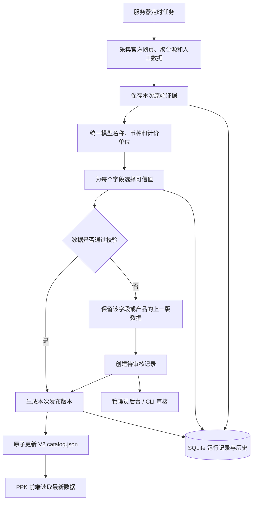
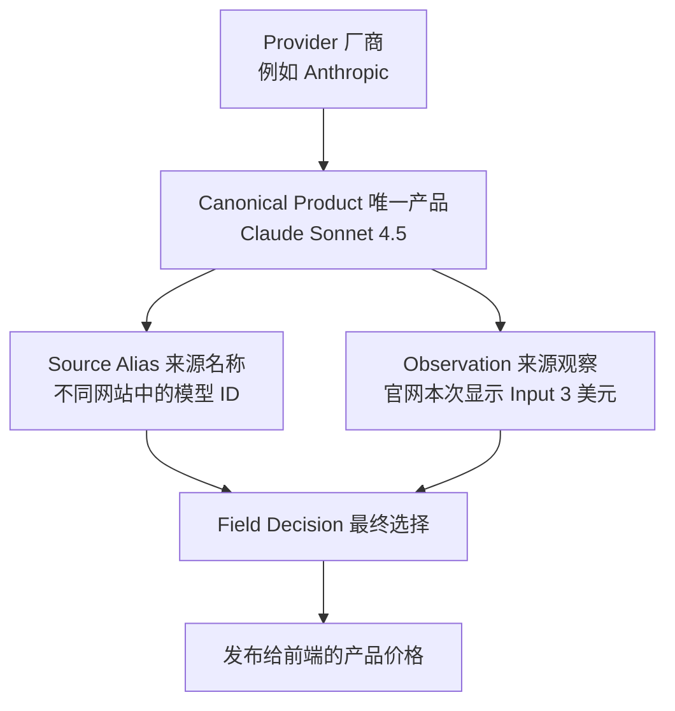
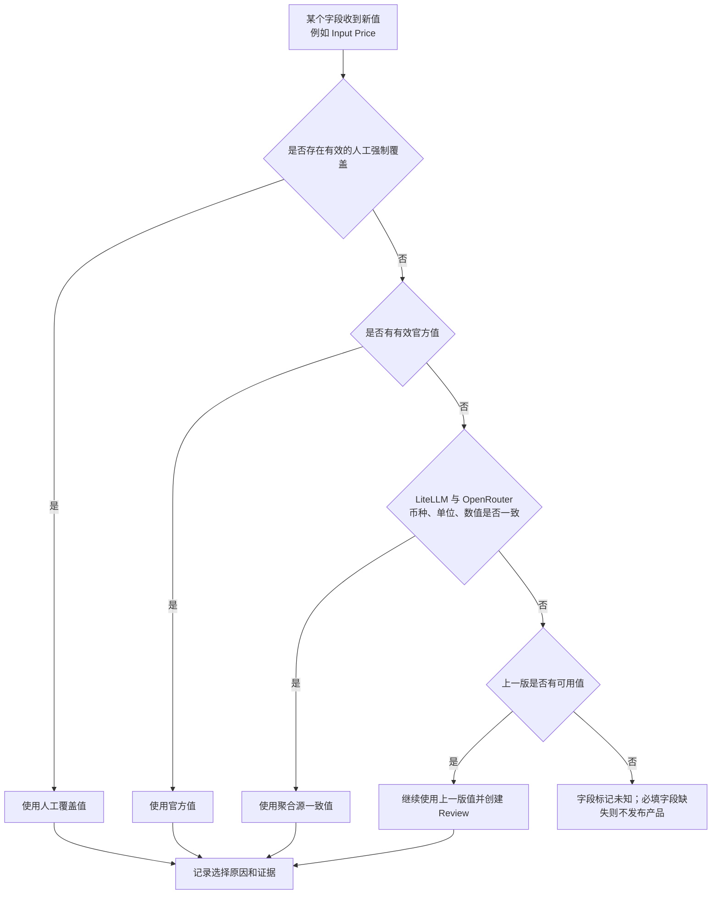
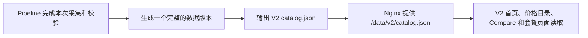

# PPK 数据获取与发布架构 V2

> 状态：目标架构与迁移设计。本文档取代旧版 Pipeline 设计，作为后续数据模块重构、测试、部署和运维基准。
>
> 核心约束：数据更新不触发代码部署；V2 使用全新的数据库、数据文件和 Schema，不迁移或兼容 V1 数据；不引入 Airflow、Kafka、Celery、Kubernetes 等重型组件。

## 1. 背景与产品目标

PPK 已经不是静态价格表。当前 UI 包含：

- 首页热门模型价格预览，以及可选择 3 个模型并排查看 Input、Output、Cache、Context 的快速比较区；
- 按需计费目录：搜索、筛选、排序、分页、币种换算；
- Compare 工作台：2～4 个模型横向比较；
- Subscription / Coding Plan Explorer：月费、首月价、额度、权益和套餐对比；
- Provider Directory、更新时间、数据源状态和可信度说明。

后期可以增加一个**仅管理员使用的轻量数据管理后台**，用于查看采集状态、审核异常价格、维护人工数据和执行发布/回滚。管理后台不直接展示给普通用户，也不与公开 UI 共用权限。普通用户只看到最终已发布价格和经过简化的数据更新时间；Evidence、Review Queue、采集错误等内部信息留在受保护的管理后台。

数据链路必须持续回答：

1. 产品是谁提供的、叫什么、何时发布、是否仍有效？
2. Input、Output、Cache 价格分别是什么，币种和单位是什么？
3. 字段来自哪里、何时观察到、是否经过官方确认？
4. 某个字段异常时，能否只冻结该字段或产品，而不是整个 Provider？
5. Plan 的月费、首月价、额度和权益是否有明确语义？
6. UI 数据有多新，哪些值正在使用 Last Known Good（LKG）？
7. 错误采集能否被隔离，任一已发布版本能否回滚？

## 2. 当前架构审计

### 2.1 值得保留的部分

当前 systemd timer 在北京时间 `05:00 / 11:00 / 17:00 / 23:00` 调用短生命周期 Pipeline；部署后还会额外异步执行一次。Pipeline 与 Nginx 通过 `runtime/public` 共享数据，JSON 使用临时文件、`fsync`、`os.replace` 原子发布。

V2 保留：

- 调度属于服务器运行环境；
- Pipeline 一次运行后退出，不在代码内常驻定时器；
- SQLite 和发布目录使用宿主机持久化；
- 数据发布不调用 Git、不重建 Web、不重启 Nginx；
- 首次数据也由 V2 来源和经过审核的 V2 Manual 生成，不使用 V1 `data/prices.json` 作为种子。

### 2.2 当前来源和链路

自动来源：LiteLLM、OpenRouter、OpenAI/Anthropic/DeepSeek 官网 Adapter。人工来源：`data/manual/*.yaml`，用于 Provider 元数据、缺失产品、Subscription、Coding Plan 和不稳定来源。

是否需要补全其他厂商 Adapter：**需要，但不建议第一期一次补齐全部厂商。** 当前只有 3 个官网 Adapter，长期只依赖聚合源和人工 YAML 会影响价格权威性；但同时开发十几个网页采集器会显著增加维护成本。V2 首期先补最影响核心按需价格的 Google、AWS、Qwen，稳定后再按数据使用量依次补 Kimi、MiniMax、智谱、火山引擎。套餐页面结构不稳定或必须登录时，优先使用带核验时间的 Manual，而不是勉强实现脆弱 Adapter。

### 2.3 核心问题

1. **回退粒度过大**：少数模型异常可能让整个 Provider 使用 LKG。
2. **没有审核闭环**：真实降价或单位修正超过阈值后可能被永久阻断。
3. **Manual 新鲜度不真实**：读取 YAML 成功不等于刚从官网核验。
4. **权威来源不足**：大量价格依赖聚合源或人工数据，官网 Adapter 只有 3 个。
5. **模型身份脆弱**：删除前缀/日期后缀可能误合并 Preview、Region、日期版。
6. **缺乏字段级证据**：最终只表达 Provider 级 sources/confidence。
7. **Fetch 能力不足**：没有统一 retry、backoff、429/5xx、ETag 和内容 hash。
8. **历史无限增长**：SQLite 全量保存多个重复 Payload，没有 retention 和备份策略。
9. **UI 状态不足**：`generated_at` 不能表达字段 observed/verified/effective 时间。

## 3. V2 原则

1. Evidence first：先保存来源证据，再生成业务 Product。
2. Field-level provenance：关键字段都有来源、观察时间和置信度。
3. Product-level isolation：异常优先冻结字段/产品，不轻易冻结 Provider。
4. Official first：官方优先；聚合源用于发现和交叉验证；Manual 是有期限覆盖。
5. Candidate before publish：任何采集先进入候选区，验证后才能发布。
6. Explicit LKG：使用旧值时记录来源 Release、回退原因和陈旧时长。
7. Versioned data contract：V2 定义新的版本化数据 Schema，V2 前端直接消费，不维护旧格式投影。
8. One process, clear stages：继续使用 Python + SQLite + 文件系统。
9. Reproducible：同一 Evidence、Mapping、Override 生成相同 Candidate。
10. Operable：异常可通过 CLI 查询、审核、重跑和回滚。

## 4. 目标数据流



这条链路的核心是：采集到的新数据不能直接覆盖线上文件。系统先保存证据、统一格式、选择可信值并校验；异常时只保留对应字段或产品的上一版数据，同时交给管理员审核；最终只发布完整且通过校验的数据。

## 5. 调度策略

不是所有数据都需要相同频率。

### `payg` Profile（按需计费数据）

这里的 `payg` 是 **Pay as you go / 按需计费** 的缩写，专指首页和“按需计费”页面展示的模型 API 价格，不包含 ChatGPT Plus、Cursor Pro 等套餐。

这类数据包括：

- 模型名称和 Provider；
- Input / 1M Tokens；
- Output / 1M Tokens；
- Cache / 1M Tokens；
- Context Window、模态和发布日期；
- 原始币种、计价单位和购买/定价页面。

- 每日 4 次：05、11、17、23 点；
- 更新 Token/API Pricing、模型元数据和下线状态；
- 运行 LiteLLM、OpenRouter、官方 API/静态 JSON和稳定官网 Adapter。

### `plans` Profile（套餐数据）

`plans` 专指“订阅制”和“Coding Plan”两个页面展示的固定费用产品，不属于按 Token 实际调用量结算的 API 价格。

这类数据包括：

- ChatGPT Plus、Claude Pro 等通用订阅；
- Cursor Pro、Coding Plan 等开发工具套餐；
- 月费、首月优惠价、币种；
- 包含额度、额度单位和主要权益；
- Free/Paid 状态和购买页面。

- 每日 1 次，例如 06:30；
- 更新 Subscription、Coding Plan、首月价、额度和权益；
- Manual-only 产品不会因为任务运行而刷新 `verified_at`。

### `full-verify` Profile（完整数据体检）

`full-verify` 不是第三类用户价格数据，而是一项每周运行的维护任务。它会把按需计费和套餐数据一起重新检查，发现平时增量任务不容易识别的问题。

它主要检查：

- 人工数据是否超过核验期限；
- 同一模型在不同来源中的名称是否仍能正确对应；
- 长期没有出现的模型是否可能下线；
- 官网页面结构是否改变；
- 是否存在长时间未处理的异常价格。

- 每周一次；
- 运行全部来源、Manual 过期检查、身份映射审计和下线候选；
- 生成 Review Queue，不自动接受高风险变化。

三种 Profile 仍由 systemd 调用同一镜像和 CLI，不需要消息队列。

## 6. 数据域

“数据域”可以简单理解为：Pipeline 内部需要明确区分的几类对象。下面的设计不是要求前端直接使用复杂结构，而是为了让后端能够回答“这条价格是谁的、从哪里来的、为什么最终采用它”。

最简单的关系是：



例如 Claude Sonnet 4.5：Provider 是 Anthropic；Canonical Product 是 PPK 内部唯一的 `anthropic/claude-sonnet-4-5`；LiteLLM 和 OpenRouter 的不同名字属于 Source Alias；官网显示 Input `$3 / 1M` 是一次 Observation；PPK 因官网优先采用 `$3` 是 Field Decision。

V2 前端读取最终发布的 `catalog.json`，不会直接读取 Evidence、Observation 和 Decision 等内部审计表。

### 6.1 Provider

Provider 就是厂商，例如 OpenAI、Anthropic、Google。它只保存稳定的厂商身份和官网入口，不保存某次任务是否成功。这样不会把“成功读取了一份人工 YAML”误解成“厂商官网价格刚刚更新”。

```yaml
id: anthropic
name: Anthropic
region: us
website: https://www.anthropic.com/
pricing_url: https://www.anthropic.com/pricing
```

### 6.2 Canonical Product

Canonical Product 是 PPK 内部认定的“唯一产品”。不同来源可能把同一模型写成不同名字，PPK 需要给它一个稳定 ID，避免搜索、排序、Compare 选择和历史记录因为名称变化而失效。

```yaml
canonical_id: anthropic/claude-sonnet-4-5
provider_id: anthropic
display_name: Claude Sonnet 4.5
product_kind: model
billing_family: payg
variant: null
region: global
release_date: 2025-09-29
status: active
```

Plan 使用同一个 Product 主体：

```yaml
canonical_id: openai/chatgpt-plus
provider_id: openai
display_name: ChatGPT Plus
product_kind: plan
billing_family: plan
plan_category: general_ai
status: active
```

V2 对外数据的输出关系：

- `payg` → `billing_type=per_token`
- General Subscription → `billing_type=subscription`
- Coding/Developer Plan → `billing_type=coding_plan`

### 6.3 Source Identity Mapping

Source Identity Mapping 是“来源名称对照表”。它告诉系统 LiteLLM、OpenRouter 和官网中的不同字符串实际对应哪个 Canonical Product。

```yaml
canonical_id: anthropic/claude-sonnet-4-5
aliases:
  litellm: [claude-sonnet-4-5-20250929]
  openrouter: [anthropic/claude-sonnet-4.5]
  anthropic_official: [claude-sonnet-4-5]
```

规则：

- 不再删除日期后缀后直接视为同一产品；
- 未识别 alias 进入 `identity_review`；
- 关键元数据冲突时不自动合并；
- Region、Preview、Batch、Long-context 等变体必须显式记录。

### 6.4 Observation

Observation 是“某个来源在某个时间实际返回了什么”。它是原始证据经过解析后的结构化记录，还不是最终发布值。

```yaml
source_id: anthropic_official
canonical_id: anthropic/claude-sonnet-4-5
field: price.input
value: 3
currency: USD
unit: per_1m_tokens
observed_at: 2026-08-19T05:00:18+08:00
effective_at: null
evidence_id: sha256:...
```

价格、Context、Modalities、Release Date、Quota、Features 均可独立追溯。

### 6.5 Field Decision

Field Decision 是最终选择结果。例如 Input 使用官网值、Context 使用 OpenRouter 值、Cache 因本次异常继续使用上一版值。它让排障时可以直接解释页面为什么显示当前数字。

```yaml
canonical_id: anthropic/claude-sonnet-4-5
field: price.input
selected_value: 3
selected_source: anthropic_official
decision: official_preferred
confidence: verified
observed_at: 2026-08-19T05:00:18+08:00
fallback_release_id: null
```

状态：`verified / corroborated / single_source / manual_verified / last_known_good / pending_review / unknown`。

## 7. 数据源策略

### 7.1 第一阶段只使用三种来源角色

第一期不实现复杂打分或五级权重。开发者只需要理解三种来源角色：

| 优先顺序 | 来源角色 | 示例 | 第一阶段处理方式 |
|---|---|---|---|
| 1 | 官方来源 | 官方 API、官方 JSON、官网定价页 Adapter | 有有效官方值就优先使用 |
| 2 | 聚合来源 | LiteLLM、OpenRouter | 补充模型、Context，并用于交叉检查价格 |
| 3 | 人工来源 | 带核验时间的 Manual Override | 官方无法稳定采集时使用，到期提醒复核 |

“人工来源”是 **PPK 自己维护的数据**。V2 第一阶段使用新的 YAML 文件；后期增加管理后台后，管理员通过后台修改 Override，数据保存到 PPK 的 SQLite，而不是直接编辑线上 `catalog.json`。无论使用 YAML 还是管理后台，都必须记录官方参考链接、核验时间和过期时间。

首期规则保持简单：官网有值就使用官网；官网没有值时，两个聚合源一致才采用；自动来源不可靠时使用未过期 Manual；新值异常时保留该字段上一版值并进入 Review；不同币种或不同单位绝不直接比较。

后续只有当来源数量和冲突场景明显增加时，再引入按字段权重。OpenRouter 的 Context/Modalities 可以补充，但其渠道价格不能自动冒充厂商官方结算价。

### 7.2 Source Contract

Source 只负责：

1. 获取原始响应；
2. 返回 Evidence 元数据；
3. 解析为 Source Record。

Source 不做仲裁、Manual 合并、LKG、发布、Git 或 UI Schema 拼装。

### 7.3 Fetch Policy

统一 Fetch Client：

- 分离 connect/read timeout；
- 网络错误、429、502、503、504 最多重试 3 次；
- exponential backoff + jitter，尊重 `Retry-After`；
- 支持 ETag / Last-Modified；
- 记录 HTTP status、响应大小、最终 URL、content hash、耗时；
- 全局并发 4、同域名并发 1、浏览器 Adapter 并发 2；
- Source 失败独立，不取消其他任务；
- HTML 保存原始证据和 parser version。

这里的 **DOM（Document Object Model，文档对象模型）**，可以简单理解为浏览器把网页 HTML 解析后形成的页面元素树。例如价格页中的标题、表格、价格单元格都对应一个 DOM 节点。官网 Adapter 通常依靠 CSS Selector 从这些节点提取价格；厂商改版后节点名称或层级改变，采集器就可能抓不到或抓错数据。因此“监控 DOM”是记录页面关键结构特征，结构明显变化时停止自动发布并提醒维护 Adapter，而不是监控用户浏览器。

### 7.4 官方 Adapter 建设顺序

1. Google Gemini；
2. AWS Bedrock；
3. 阿里云百炼 / Qwen；
4. Kimi；
5. MiniMax；
6. 智谱；
7. 火山引擎；
8. Cursor、GitHub Copilot、Kiro 等套餐来源。

必须登录或页面极不稳定时，不强行写 Scraper；保留 Manual，但要求核验期限和来源 URL。

## 8. Normalize 与单位

Normalize 只做无争议转换：身份解析、decimal、`per_token → per_1m_tokens`、时间和枚举标准化。原始值始终保留在 Evidence。

### 8.1 Currency

- Canonical 保存官方原始币种；
- 展示换算使用独立 FX Snapshot；
- 比较前必须转为同一币种；
- Release 记录 `fx_rate/fx_observed_at/fx_source`；
- 硬编码 `USD_TO_CNY=7.2` 只能作为 V2 初期缺少实时汇率时的临时兜底，并且必须在 Release metadata 中明确记录。

### 8.2 Unit

至少支持：`per_1m_tokens / per_1m_cached_tokens / per_request / per_image / per_minute / per_month`。不同单位禁止参与同一个最低价比较。

### 8.3 Plan Quota

V2 不沿用旧额度字段，直接使用结构化 `allowance` 表达额度类型、数值和单位，第一阶段至少支持：

- credits、calls、prompts、AFP；
- monetary_credit；
- base_multiplier。

额度只并排展示，不跨类型判断“更优”。`base` 等含义不明的单位进入 Review 或 Manual 说明。

## 9. 字段级仲裁

“仲裁”就是：同一个字段从多个来源拿到不同结果时，决定最终发布哪个值。它不是复杂评分系统，第一阶段按照固定顺序判断即可。



人工强制覆盖是明确的管理员操作，只用于官网无法稳定采集或修正已知错误；普通人工补充数据不能无条件覆盖更新鲜的官方值。

### 9.1 决策顺序

1. 存在管理员明确设置且未过期的强制 Manual Override 时使用该值；
2. 官方 API、官方 JSON 或官方定价文档；
3. 官网 Adapter 解析出的有效数据；
4. LiteLLM 和 OpenRouter 在同币种、同单位下结果一致；
5. 只有一个聚合来源时可发布为 `single_source`，但不能覆盖更新鲜的官方值；
6. 候选失败则回退该字段 LKG；
7. 没有 LKG 则 unknown，必填字段 unknown 时拒绝产品。

### 9.2 冲突规则

- 币种或单位不同：禁止数值投票；
- 官方与聚合冲突：采用官方并 warning；
- 两个官方来源冲突：Review + LKG；
- 高风险价格变化：只冻结字段；
- Product 数量骤降：缺失产品进入 grace period；
- 大量未知模型：进入 identity review。

V2 不再使用“简单中位数”作为权威价格。来源可能代表官方价、渠道价或错误单位，中位数不天然正确。

## 10. Validation 与 Drift

### Source 层

- HTTP/解析、空响应、Schema/DOM signature；
- 产品数相对该来源历史；
- parser version。

### Observation 层

- decimal/currency/unit 有效，价格非负；
- Context 合理；observed_at 不来自未来；
- Purchase URL 属于官方或明确渠道域名。

### Product 层

- Canonical ID 唯一；
- Provider、名称、billing family 完整；
- Payg 至少有 Input/Output；
- Plan 有 monthly price 或明确 Free；
- Coding Plan 缺 quota 可显示未知，不能伪造“不限量”。

### Drift 层

建议默认值：

- 价格变化 >20%：warning；
- 价格变化 >50%：pending_review；
- 产品下降 >30%：缺失产品进入 grace period；
- 产品暴增 >100%：identity review；
- Manual 过期：aging/stale；
- 单聚合源超过 7 天无官方/第二来源佐证：降低 confidence。

阈值按 Provider/Source 可配置，不只使用全局常量。

### Release 层

- Provider/Product 最低规模；
- 首页 Featured 产品和默认 Compare 模型存在；
- 重复 ID 为零；
- V2 `catalog.json` 通过 JSON Schema；
- 与线上 Release 的变化摘要可解释；
- 前端 smoke test 能加载输出。

## 11. Review Queue 与 Manual

创建 Review 的情况：高风险价格变化、官方冲突、未知 Alias、疑似下线、Manual 过期、额度单位未知、DOM signature 改变。

状态：`open / approved / rejected / superseded`。

```bash
python3 -m scripts.pipeline_v2.cli review list
python3 -m scripts.pipeline_v2.cli review show <review_id>
python3 -m scripts.pipeline_v2.cli review approve <review_id> --accept-baseline
python3 -m scripts.pipeline_v2.cli review reject <review_id> --reason "unit mismatch"
python3 -m scripts.pipeline_v2.cli review map <review_id> --canonical-id <id>
```

批准动作记录操作者、时间、旧值、新值、Evidence 和理由。

Manual V2：

```yaml
canonical_id: cursor/cursor-pro
fields:
  price.monthly:
    value: 20
    currency: USD
    unit: per_month
source_url: https://cursor.com/pricing
verified_at: 2026-08-19T10:00:00+08:00
expires_at: 2026-09-19T10:00:00+08:00
reason: official page is not reliably machine-readable
```

过期 Override 保留但标记 `manual_stale` 并告警，不再因 Pipeline 读取而刷新验证时间。

## 12. 存储设计

### 12.1 SQLite 控制与审计库

V2 按一个新系统建设，不迁移、不读取、也不保留旧 SQLite 历史。部署时直接创建全新的 V2 SQLite，数据以官方来源、聚合来源、V2 Manual 和仓库中的种子数据重新生成。旧数据库可以直接删除；V2 的发布回滚只依赖 V2 自己创建的不可变 Release，不依赖任何 V1 数据。

V2 新表：

| 表 | 职责 |
|---|---|
| `runs_v2` | Pipeline run |
| `source_runs_v2` | Source 状态、HTTP 元数据、耗时 |
| `evidence_v2` | Evidence hash 和 artifact path |
| `source_records_v2` | 来源解析结果 |
| `product_aliases_v2` | Source ID → Canonical ID |
| `field_observations_v2` | 字段观察 |
| `field_decisions_v2` | 仲裁结果和依据 |
| `product_candidates_v2` | Product 候选状态 |
| `review_items_v2` | 待审核异常 |
| `releases_v2` | 不可变 Release/checksum |
| `release_changes_v2` | 字段级差异 |
| `alerts_v2` | 告警结果 |

SQLite 开启 WAL、foreign keys、busy timeout。Stage/Decision/Release 使用明确事务。发布文件成功后才标记 published；元数据后写失败必须告警但不删除已发布文件。

### 12.2 Raw Artifact 拆出 SQLite

完整 HTML/JSON 使用 gzip 文件，SQLite 只保存索引：

```text
runtime/
  raw/2026/08/19/<run_id>/<source_id>/<sha256>.json.gz
  releases/<release_id>/catalog-v2.json.gz
  public/v2/catalog.json
  public/v2/status.json
  public/run_status.json
  prices.db
```

这样避免数据库被大段原文快速撑大，同时保留可追溯证据和 hash 去重。

### 12.3 Retention / Backup

- Raw Evidence：90 天；
- Source Record：180 天；
- Release：最近 30 个 + 每日最后一个保留 1 年；
- Change/Review/Audit：长期；
- 每周 checkpoint、每月 VACUUM；
- 每日备份 SQLite 和当前 Release 到不同磁盘或对象存储。

## 13. Pipeline 如何把 V2 数据交给网站

V2 不再生成或兼容旧 `prices.json`。Pipeline 使用新数据库整理数据，再生成一份全新的 V2 Catalog；网站前端同步改为读取这份新数据。

最简单的理解是：



### 13.1 V2 网站读取的数据文件

V2 网站统一读取：

```text
GET /data/v2/catalog.json
```

文件使用全新 Schema，例如顶层明确区分厂商、按需计费模型和套餐：

```json
{
  "schema_version": "2.0",
  "release_id": "2026-08-19T110000Z",
  "published_at": "2026-08-19T11:00:00Z",
  "providers": [],
  "models": [],
  "plans": []
}
```

具体 Product、Price、Allowance 和来源状态字段以 V2 JSON Schema 为准。旧字段名称、旧嵌套层级和旧 ID 如果不合理，可以直接删除或重新定义；不再编写 `projector_legacy.py` 做旧格式转换。

V2 数据库内部会保存来源证据、核验时间和最终选择理由。这些审计信息默认不塞进公开 Catalog，避免文件过大，也避免前端依赖内部实现。

### 13.2 单独的运行状态文件

Pipeline 另外生成：

```text
GET /data/v2/status.json
```

它不保存产品价格，而是回答“这批数据是否健康”，例如：

- 本次数据何时发布、对应哪个版本；
- 哪些数据源成功或失败；
- 哪些厂商全部更新成功；
- 哪些产品暂时沿用了上一版数据；
- 是否存在过期人工数据或待审核异常。

普通价格页面不必直接展示这些技术细节。它主要供管理后台、状态页和运维排障使用。

### 13.3 为什么按完整版本发布

Pipeline 不会一边采集一边修改线上 `catalog.json`。它先在独立目录中生成并校验一个完整版本，全部通过后才一次性切换为当前版本。

这样可以避免用户刚好读到只写了一半的 JSON，也能避免 OpenAI 已更新、Anthropic 还没处理完时出现一份不完整的混合数据。切换失败时，网站继续读取上一个完整版本。

## 14. 采集异常时如何保留上一版正确数据

这里使用的 **Last Known Good（LKG）**，就是“最近一次已经通过校验并成功发布的数据”。它的作用是防止临时网络故障、官网改版或错误解析直接污染线上价格。

例如，上一版 Claude 某模型的 Input 价格是 `$3 / 1M`。本次采集因为官网页面改版错误地读成 `$300 / 1M`：

1. 校验发现价格异常变化；
2. 本次 `$300` 不直接发布；
3. 网站暂时继续显示上一版已经确认的 `$3`；
4. 系统标记该字段正在使用旧值，并创建待审核记录；
5. 管理员修复采集器或确认真实价格后，下次再发布新值。

系统尽量只回退发生问题的最小范围：

| 异常范围 | 处理方式 |
|---|---|
| 只有一个价格字段异常 | 只沿用该字段上一版的值 |
| 一个产品的大部分数据异常 | 该产品整体沿用上一版 |
| 一个厂商本次完全采集失败 | 该厂商沿用上一版，其他厂商正常更新 |
| 整个新版本无法通过校验 | 不发布本次结果，网站继续使用上一个完整版本 |

每次沿用旧数据都会记录：从哪个版本取值、从何时开始沿用、已经陈旧多久、失败原因和对应审核记录。这样 LKG 是临时安全措施，而不是悄悄永久展示旧价格。

对外的 V2 Catalog 可以把相关产品或厂商标记为 `stale`（数据不是最新）；V2 管理状态还会使用 `partial` 表示“只有部分字段或产品沿用了旧值”。

## 15. Change Detection

记录：价格变化、字段出现/消失、产品新增/缺失/下线、Context/Modalities、Plan quota/features、来源权威性、confidence/freshness 变化。

价格百分比只在统一单位和币种下计算；币种变化单独记录，不能静默跳过。

## 16. 告警与观测

| 级别 | 示例 |
|---|---|
| P0 | 无可发布 Release、文件损坏、所有自动源失败 |
| P1 | 官方冲突、Featured 产品失效、Provider 大面积回退 |
| P2 | 单产品待审核、Manual 过期、Source 连续失败 |
| INFO | 新模型、正常价格变化、发布摘要 |

观测指标：最近成功时间、Release age、Source 成功率/耗时/产品数、Provider partial/stale、Field LKG 数和最大 stale age、Review 数和等待时间、Manual stale 数、各 billing family 数量、磁盘占用、告警投递状态。

使用 journald 保存完整日志，飞书发送数据异常；systemd service failure 负责基础设施告警，并准备备用邮件/GitHub Issue，避免 Webhook 未配置时静默。

## 17. 目标目录

```text
scripts/pipeline_v2/
  cli.py
  config.py
  orchestrator.py
  fetch/{client.py,policy.py}
  sources/{base.py,litellm.py,openrouter.py,official/}
  evidence/store.py
  normalize/{records.py,units.py,currency.py}
  identity/{resolver.py,mappings.py}
  reconcile/{field_policy.py,engine.py}
  overrides/{loader.py,validation.py}
  validate/{source.py,observation.py,product.py,drift.py,release.py}
  review/{repository.py,commands.py}
  storage/{schema.sql,repository.py,retention.py}
  release/{builder.py,publisher.py}
  observability/{status.py,alerts.py,logging.py}
data/
  identity/model_aliases.yaml
  overrides/providers/*.yaml
ops/systemd/
  ppk-payg-pipeline.timer
  ppk-plans-pipeline.timer
  ppk-full-verify.timer
```

## 18. 旧模块迁移映射

| 当前模块 | V2 处理 |
|---|---|
| `pipeline/runner.py` | 替换为 stage-based orchestrator |
| `pipeline/collector.py` | 替换为 Fetch + Evidence contract |
| `sources/*` | 保留解析思路，适配新 Contract |
| `adapters/*` | 保留可用 parser，输出 Evidence/Source Record |
| `core/reconcile.py` | 推倒重写为字段级、来源语义仲裁 |
| `pipeline/guardrails.py` | 拆成多层 Validator |
| `pipeline/normalize.py` | 拆为 identity/unit/currency/projection |
| `core/manual.py` | 替换为带 verified/expires 的 Override Loader |
| `pipeline/storage.py` | 保留 Repository 思路，迁移 V2 schema |
| `core/history.py` | V2 稳定后删除重复快照路径 |
| `pipeline/publisher.py` | 保留原子写核心，扩展 Release Builder |
| `pipeline/changes.py` | 扩展生命周期和状态变化 |
| `pipeline/alerts.py` | 增加级别、连续失败、备用通道 |
| `run_daily.py` | 切换后删除，不保留模糊入口 |

## 19. 实施计划：V2 作为新系统直接建设

由于 V1 网站当前访问量不高，V2 可以按新网站的数据系统直接建设：不迁移旧 SQLite、不复用旧表，也不安排长期双轨运行。V2 仍需具备自己的发布版本和回滚能力，但回滚对象是 V2 之前发布成功的版本，而不是 V1 数据库。

### Phase 0：数据契约基线

- 从 V2 页面需求重新定义 `catalog-v2.schema.json`，不以旧 `prices.json` 为模板；
- 为 V2 首页、按需目录、Compare、Subscription、Coding Plan 建立新契约测试；
- 当前 Provider/Product ID 只作为名称核对参考，不导入 V1 历史记录；
- 从官方来源、聚合来源、V2 Manual 和明确审核过的种子数据建立第一版目录。

### Phase 1：建立全新 V2 骨架

- 新建 `pipeline_v2`、V2 SQLite Schema、Fetch Client 和 Evidence Store；
- 迁移 LiteLLM、OpenRouter 和 3 个可用 Adapter；
- 新实现只写测试发布目录，不在旧 Pipeline 内做双写。

验收：连续手工运行至少 3 次，Evidence 可追溯，Source 失败不会污染候选。

### Phase 2：Canonical Identity

- 建立 Alias Registry 和 identity review；
- 审计全部当前模型；
- 停止粗暴删除日期后缀合并。

### Phase 3：Field Reconcile 与数据核对

- V2 生成 Candidate，但暂不覆盖生产文件；
- 与线上 JSON 字段 diff；
- 为当前 OpenAI、DeepSeek、Qwen 异常建立 Review。

验收：关键模型与官方一致，所有差异有 Evidence/Decision。

### Phase 4：V2 Catalog 与新网站切换

- V2 输出 `runtime/public/v2/catalog.json` 和 `status.json`；
- 执行 Schema、UI smoke、数量和关键价格检查；
- V2 前端改为读取 `/data/v2/catalog.json`；
- 检查通过后停用旧 timer，并切换到 V2 网站与 V2 发布目录；
- 不迁移、不归档旧 SQLite；确认服务器不再使用后即可删除；
- 首次上线前由 V2 自己生成一个通过校验的初始 Release，作为 V2 的回滚基线。

切换后如发生异常，只切回上一个 V2 Release，无需恢复 V1 数据库或重新部署代码。

### Phase 5：Review / Manual / Freshness

- 上线 Review CLI；
- Manual 补齐 verified/expires/source_url；
- 状态端点表达 partial/LKG age。

### Phase 6：删除旧路径

- 停旧 timer；
- 删除 `run_daily.py` 和重复 `core/history.py` 写入；
- 删除旧 SQLite、旧表和仅服务 V1 的运行文件；
- 移除旧 Provider 级 Reconcile。

## 20. 测试要求

### Fetch

- timeout/DNS/429/5xx、重试、304/ETag、空响应、解析失败、DOM 变化、Evidence 写失败。

### Identity

- Alias 命中、未知 Alias Review、日期/Preview/Region 不误合并、Canonical 冲突。

### Reconcile

- 官方优先、聚合一致、币种/单位不同禁止投票、字段 LKG、Manual 有效/过期、产品缺失 grace period。

### Validation

- 负数/缺失、产品骤减/暴增、真实大幅变价进入 Review、Featured 缺失、异构 quota 安全展示。

### Storage/Publish

- Stage 失败不污染 Release、序列化失败保留现网、metadata 失败恢复、checksum、版本回滚、retention 引用保护。

### UI Contract

- V2 Catalog Schema；Cache 缺失显示 `—`；统一币种换算；Compare ID 稳定；Plan 字段完整；Featured 产品存在。

## 21. 部署、手工运行与排障

Timer 建议：

```text
payg       05,11,17,23:00 Asia/Shanghai
plans      06:30 Asia/Shanghai
full       Sunday 08:00 Asia/Shanghai
```

```bash
# dry-run
python3 -m scripts.pipeline_v2.cli run --profile payg --dry-run

# 正式运行
python3 -m scripts.pipeline_v2.cli run --profile payg

# 状态、字段解释、审核、回滚
python3 -m scripts.pipeline_v2.cli status
python3 -m scripts.pipeline_v2.cli explain anthropic/claude-sonnet-4-5
python3 -m scripts.pipeline_v2.cli review list
python3 -m scripts.pipeline_v2.cli release rollback <release_id>

# 清理预览
python3 -m scripts.pipeline_v2.cli maintenance retention --dry-run
```

排障顺序：systemd → journal/run_id → Source 状态 → `explain` Evidence/Decision → Review → Release diff → 必要时回滚。禁止直接编辑线上 JSON。

## 22. 安全

- Pipeline 不持有 Git push 凭证；
- Web 只读挂载发布目录；
- Pipeline 只写 runtime/Evidence/SQLite；
- Secret 通过服务器环境注入；
- Raw Evidence 不由 Nginx 公开；
- Purchase URL 使用域名 allowlist；
- Review approve 和 rollback 写审计日志。

## 23. 成功标准

- 数据发布与代码部署完全独立；
- 任一 Source 失败不污染发布数据；
- 单产品异常不冻结整个 Provider；
- 每个关键价格字段可追溯到 Evidence；
- Manual 有真实核验时间和过期状态；
- stale 不会无限静默；
- V2 Catalog Schema 清晰、经过版本化，并由 V2 页面契约测试覆盖；
- 能快速解释“为什么显示这个价格”；
- 能 dry-run、审核新基线和回滚 Release；
- SQLite/Raw Artifact 有 retention 和备份。

## 24. 不做的事情与最终建议

当前不引入 Airflow、Kafka、Celery/Redis、Kubernetes、微服务集群或机器学习置信度模型。复杂度应放在数据语义和证据审计，而非基础设施。

可以推倒重写：

- Provider 级、数值投票式 `core/reconcile.py`；
- 粗粒度 Guardrails；
- 无核验期限的 Manual 合并；
- 字符串清洗式身份逻辑；
- SQLite 内重复保存大量完整 Payload。

应该保留并演进：

- systemd 调度；
- 一次性 Pipeline 容器；
- SQLite 审计库；
- LKG 思路；
- 原子 JSON 发布；
- V2 Catalog 构建与原子发布；
- 数据更新不触发 Git 或部署。

先完成 Phase 0～3，在测试目录连续运行并完成关键数据核对，然后直接切换 V2 网站和 V2 数据。不保留旧数据库、不输出旧 Schema，也不做长期双轨；不能省略的是 V2 UI 契约测试、V2 初始 Release 和 V2 Release 回滚验证。
