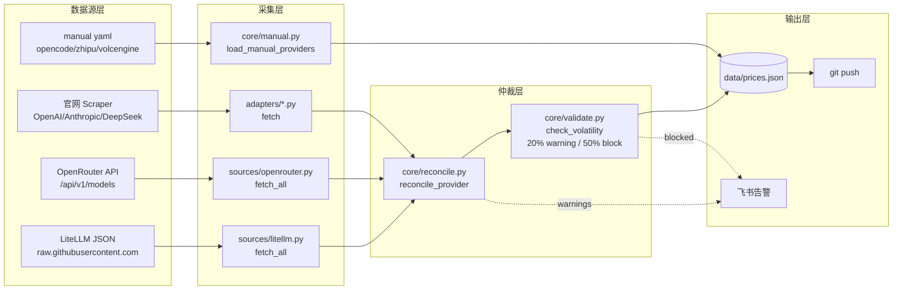
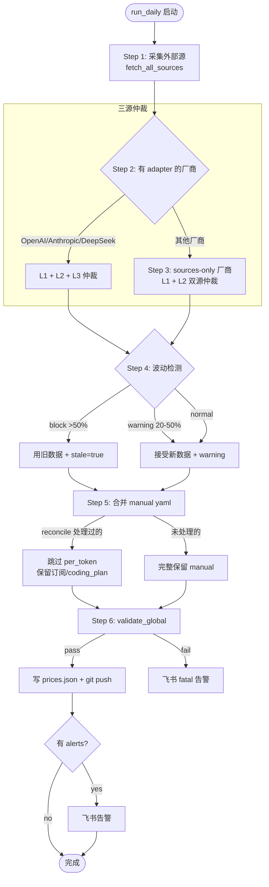
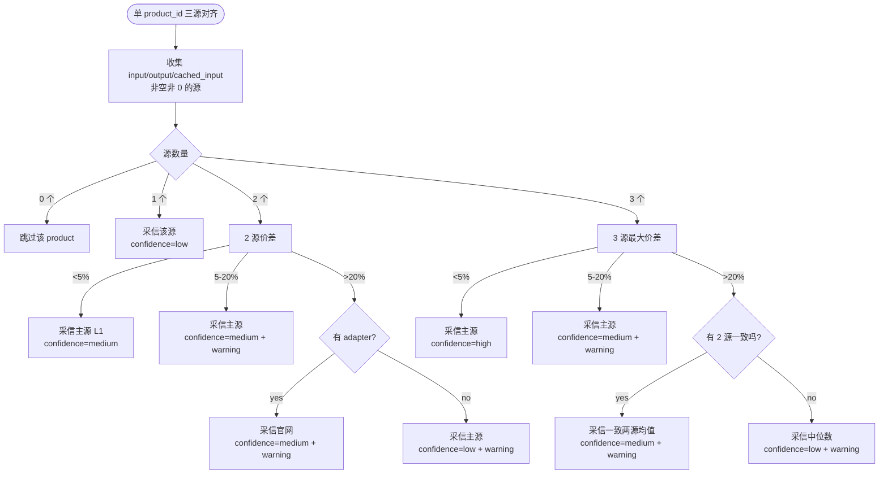
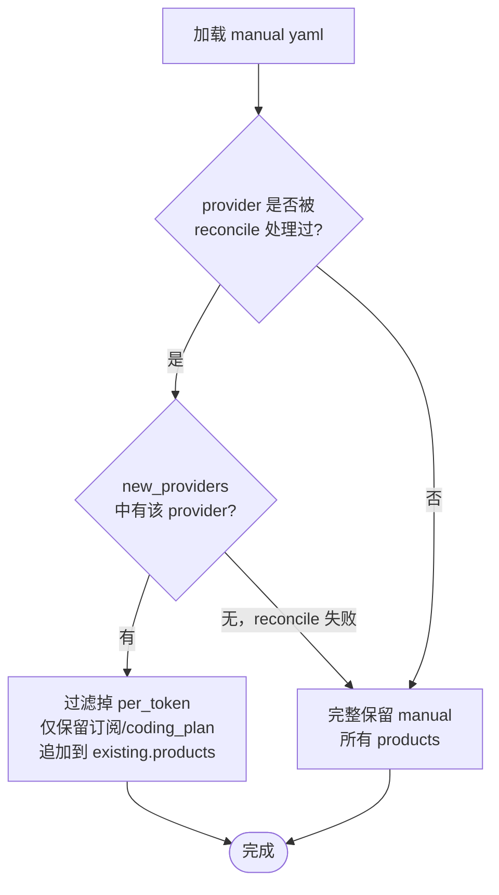
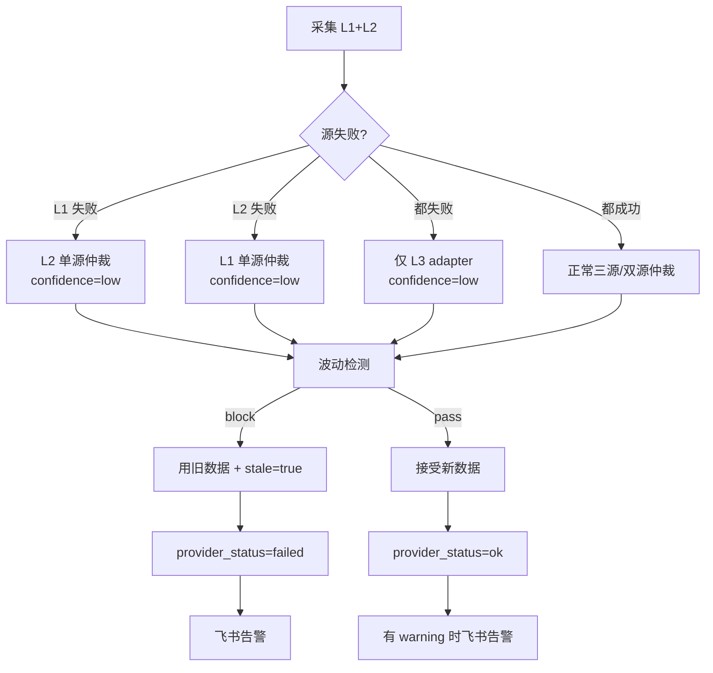

# 三源交叉验证仲裁设计

## 一、背景与目标

现有架构中，每家厂商由独立适配器抓取官网价格，存在三个核心痛点：

1. **页面改版静默失效**——OpenAI/Anthropic 等官网结构变化导致解析失败
2. **403 反爬**——openai.com/api/pricing 等页面拦截 bot UA
3. **Playwright 环境脆弱**——headless 浏览器在 Docker 中部署成本高

引入外部数据源做交叉验证，把"抓 HTML"这件事外包给社区维护的数据集，**官网适配器降级为兜底**。同时通过多源价差检测，提升数据可信度，暴露 confidence 到前端。

## 二、三源定位

```
┌────────────────────────────────────────────────────────────────┐
│  L1: LiteLLM JSON      ── per_token 主源                       │
│  - 静态 JSON 文件，无鉴权，可缓存可 fork                        │
│  - 覆盖 9/12 厂商（缺 opencode/zhipu/xiaomi）                  │
│  - 实测质量：openai/anthropic/google/deepseek/moonshot/qwen 良好│
│  - 已知问题：volcengine 价格全 0（社区占位数据，源层已过滤）    │
├────────────────────────────────────────────────────────────────┤
│  L2: OpenRouter API     ── per_token 交叉源 + 能力元数据       │
│  - REST API，无鉴权，无限流                                     │
│  - 覆盖 7/12 厂商（缺 aws/opencode/volcengine/zhipu）          │
│  - 独有字段：benchmarks / reasoning / expiration_date          │
│  - 价格作为第三个参考源参与仲裁                                 │
├────────────────────────────────────────────────────────────────┤
│  L3: 官网 Scraper       ── 兜底 + 订阅/Coding Plan 唯一来源    │
│  - 现有 adapter 保留：OpenAI / Anthropic / DeepSeek            │
│  - per_token 数据在 L1/L2 都缺时回退抓取                       │
│  - subscription / coding_plan 仍由 adapter/manual 提供         │
└────────────────────────────────────────────────────────────────┘
```

### 三源覆盖率实测

| Provider | LiteLLM | OpenRouter | Scraper | manual yaml |
|---|---|---|---|---|
| openai | ✅ 219 | ✅ 70 | ✅ adapter | — |
| anthropic | ✅ 23 | ✅ 19 | ✅ adapter | — |
| deepseek | ✅ 12 | ✅ 11 | ✅ adapter | — |
| google | ✅ 124 | ✅ 30 | — | ✅ yaml |
| aws | ✅ 273 | ❌ | — | — |
| moonshot | ✅ 22 | ✅ 7 | — | ✅ yaml |
| qwen | ✅ 34 | ✅ 49 | — | ✅ yaml |
| minimax | ✅ 10 | ✅ 8 | — | — |
| xiaomi | ❌ | ✅ 2 | — | — |
| volcengine | ⚠️ 价格全 0 | ❌ | — | ✅ yaml |
| opencode | ❌ | ❌ | — | ✅ yaml |
| zhipu | ❌ | ❌ | — | ✅ yaml |

> volcengine LiteLLM 有条目但价格为 0，源层 `litellm.py` 已通过 `if input_cost is None or output_cost is None: continue` 过滤，等同于未覆盖，走 manual 兜底。

## 三、整体架构

### 目录结构

```
scripts/
├── sources/                    # 新增：外部数据源采集层
│   ├── __init__.py             # SOURCES 注册 + fetch_all_sources()
│   ├── base.py                 # SourceBase 抽象类
│   ├── litellm.py              # L1: LiteLLM JSON 源
│   └── openrouter.py           # L2: OpenRouter API 源
├── adapters/                   # 保留: 官网 Scraper (L3)
│   ├── openai.py
│   ├── anthropic.py
│   └── deepseek.py
├── core/
│   ├── reconcile.py            # 新增: 三源仲裁
│   ├── validate.py             # 保留: 20%/50% 波动检测
│   └── ...
└── run_daily.py                # 改造: 三源采集 + 仲裁
```

### 数据流



### run_daily.py 主流程



## 四、字段映射规范

### LiteLLM → Product

| LiteLLM 字段 | Product 字段 | 转换 |
|---|---|---|
| `litellm_provider` | `provider_id` | 通过 `PROVIDER_MAP` 反查（如 `dashscope` → `qwen`） |
| model key（去 `provider/` 前缀 + 去日期后缀） | `model` / `id` | `dashscope/qwen-coder` → `qwen-coder` |
| `input_cost_per_token` | `prices.input` | × 1e6（per-token → per-1M-tokens） |
| `output_cost_per_token` | `prices.output` | × 1e6 |
| `cache_read_input_token_cost` | `prices.cached_input` | × 1e6，None 或 0 视为缺失 |
| `max_input_tokens` / `max_tokens` | `context_window` | 优先 max_input_tokens |
| `supports_vision` | `modalities` | true → 加 `vision` |
| `mode == "chat"` | 过滤条件 | 排除 image/audio/embedding 模型 |
| — | `currency` | 固定 `USD` |
| — | `unit` | 固定 `per_1m_tokens` |
| — | `purchase_url` | `_FALLBACK_URLS[pid]` 兜底 |

### OpenRouter → Product

| OpenRouter 字段 | Product 字段 | 转换 |
|---|---|---|
| `id` 前缀（`anthropic/...`） | `provider_id` | 通过 `PROVIDER_MAP` 反查 |
| `id` 后半段 | `model` / `id` | `anthropic/claude-sonnet-5` → `claude-sonnet-5` |
| `pricing.prompt` | `prices.input` | float(s) × 1e6 |
| `pricing.completion` | `prices.output` | float(s) × 1e6 |
| `pricing.input_cache_read` | `prices.cached_input` | float(s) × 1e6 |
| `context_length` | `context_window` | 直接取 |
| `architecture.input_modalities` | `modalities` | `image` → `vision`，`audio` → `audio` |
| `architecture.output_modalities` | 过滤条件 | 仅保留含 `text` 的 |
| `benchmarks.artificial_analysis` | `notes`（JSON 字符串） | 序列化存储，含 intelligence/coding/agentic index |
| `reasoning.supported_efforts` | `notes` | 同上，含 mandatory / default_effort |
| `expiration_date` | `notes` | 同上，标识即将下线 |
| — | `purchase_url` | `https://openrouter.ai/{model_id_full}` |

## 五、仲裁规则

### 维度

- **按 provider_id 分组**：每个 provider 独立仲裁
- **按 product_id 对齐**：三源中相同 `model-token` id 的产品对齐
- **按价格字段投票**：input / output / cached_input 三个字段分别仲裁

### 价格投票矩阵



### 元数据合并策略

| 字段 | 合并策略 |
|---|---|
| `context_window` | 三源取**众数**（多数派） |
| `modalities` | 取**并集** |
| `notes` | 优先取 OpenRouter 的（含 benchmarks/reasoning 元数据） |
| `purchase_url` | 优先级：adapter > litellm > openrouter |
| `currency` / `unit` | 任取一源（统一 USD / per_1m_tokens） |
| `model` | 任取一源 |

### 阈值常量

```python
_TIGHT_PCT = 5.0     # <5% 视为一致
_DIVERGE_PCT = 20.0  # >20% 视为偏离
```

> 阈值与现有 `check_volatility` 的 20%/50% 阈值有意保持协同：
> - 仲裁层 20% 偏离 → warning，但不阻塞
> - 波动层 20% → warning，50% → block
> 两个维度正交：仲裁解决"今天数据对不对"，波动解决"今天和昨天比是否异常"。

## 六、confidence 字段输出到前端

`provider_status` 新增字段：

```json
{
  "provider_id": "openai",
  "status": "ok",
  "last_success_at": "2026-07-13T15:00:00+08:00",
  "stale": false,
  "warnings": [],
  "confidence": "high",
  "sources": ["litellm", "openrouter", "adapter"]
}
```

| confidence | 含义 | 触发条件 |
|---|---|---|
| `high` | 三源一致 | 3 源都有且价差 <5% |
| `medium` | 2 源一致或官网兜底 | 2 源一致 / 3 源有 1 偏离 / 2 源偏离但官网裁决 |
| `low` | 仅 1 源或三源互差大 | 1 源 / 3 源互差 >20% 无一致对 |
| `manual` | 走 manual yaml | 厂商未被 sources 覆盖（opencode/zhipu/volcengine） |

前端 `app.js` 可在 provider card 上展示 confidence 标签，让用户感知数据可信度。

## 七、manual yaml 合并策略



### 各 provider 的 manual 合并路径

| Provider | reconcile 是否处理 | manual 处理 |
|---|---|---|
| openai/anthropic/deepseek | ✅ 三源仲裁 | 跳过 per_token，无订阅/coding_plan → 不合并 |
| google/moonshot/qwen/minimax | ✅ 双源仲裁 | 跳过 per_token，保留订阅/coding_plan |
| aws | ✅ LiteLLM 单源 | 跳过 per_token |
| xiaomi | ✅ OpenRouter 单源 | 跳过 per_token |
| volcengine | ❌ sources 都空 | 完整保留 manual |
| opencode/zhipu | ❌ sources 未覆盖 | 完整保留 manual |

## 八、失败隔离与降级



### 降级链路

1. **L1 + L2 + L3 都正常** → 三源仲裁，confidence=high/medium
2. **L1 或 L2 单源失败** → 双源仲裁（含 L3），confidence=medium
3. **L1 + L2 都失败** → 仅 L3 adapter，confidence=low
4. **L3 adapter 失败** → 不影响 L1+L2 仲裁
5. **三源全失败** → 用旧数据 + `stale=true` + 飞书告警
6. **波动 >50%** → 用旧数据 + `stale=true` + 飞书告警（与仲裁结果无关）

## 九、与现有系统的兼容性

### 保留不变

- `data/prices.json` schema 不变（仅 `provider_status` 新增可选字段 `confidence` / `sources`）
- `data/manual/*.yaml` schema 不变
- `scripts/adapters/*.py` 接口不变，仍可独立运行
- `scripts/core/validate.py` 的 `check_volatility` 和 `validate_global` 不变
- `scripts/core/alert.py` 飞书告警机制不变
- 前端 `ui/app.js` 无需改造即可正常工作（新字段是可选的）

### 新增

- `scripts/sources/` 整个目录
- `scripts/core/reconcile.py`
- `provider_status.confidence` 字段（可选）
- `provider_status.sources` 字段（可选）
- `product.notes` 字段在 reconcile 后可能含 OpenRouter 元数据 JSON

## 十、运维与监控

### 日志输出示例

```
2026-07-13T15:00:00+08:00 INFO  run_daily: step 1: fetching external sources
2026-07-13T15:00:02+08:00 INFO  sources.litellm: fetching https://raw.githubusercontent.com/...
2026-07-13T15:00:05+08:00 INFO  sources.litellm: litellm openai: 45 products
2026-07-13T15:00:05+08:00 INFO  sources.litellm: litellm anthropic: 12 products
2026-07-13T15:00:05+08:00 INFO  sources.openrouter: fetching https://openrouter.ai/api/v1/models
2026-07-13T15:00:06+08:00 INFO  sources.openrouter: openrouter total models: 345
2026-07-13T15:00:06+08:00 INFO  sources.openrouter: openrouter openai: 50 products
2026-07-13T15:00:06+08:00 INFO  run_daily: step 2: reconciling providers with adapter (L1+L2+L3)
2026-07-13T15:00:08+08:00 INFO  core.reconcile: reconcile openai: 50 products, confidence=high, sources=['litellm', 'openrouter', 'adapter'], 0 warnings
2026-07-13T15:00:08+08:00 INFO  core.reconcile: reconcile anthropic: 12 products, confidence=high, sources=['litellm', 'openrouter', 'adapter'], 0 warnings
2026-07-13T15:00:09+08:00 INFO  core.reconcile: reconcile deepseek: 8 products, confidence=medium, sources=['litellm', 'openrouter', 'adapter'], 2 warnings
2026-07-13T15:00:09+08:00 INFO  run_daily: step 3: reconciling sources-only providers (L1+L2)
2026-07-13T15:00:09+08:00 INFO  core.reconcile: reconcile google: 28 products, confidence=medium, sources=['litellm', 'openrouter'], 1 warnings
2026-07-13T15:00:09+08:00 INFO  run_daily: step 4: merging manual yaml
2026-07-13T15:00:09+08:00 INFO  run_daily: zhipu: kept all manual products (not in sources)
2026-07-13T15:00:09+08:00 INFO  run_daily: volcengine: both sources empty, fallback to manual
2026-07-13T15:00:09+08:00 INFO  run_daily: run_daily finished, 12 providers, 3 alerts
```

### 飞书告警类型

| alert 类型 | 触发条件 | 处理 |
|---|---|---|
| `warning` | reconcile 价差 5-20% | 提示，不阻塞 |
| `warning` | 波动 20-50% | 提示，已更新数据 |
| `blocked` | 波动 >50% | 已用旧数据，需人工介入 |
| `failed` | adapter 抓取失败 | 已用旧数据 + stale=true |
| `fatal` | global validation 失败 | 数据未写盘，需立即介入 |

## 十一、未来扩展

1. **pricetoken.ai 接入**：作为 L4 置信度裁判，用 `confidenceScore` 和 `freshness` 替代当前的 high/medium/low 启发式
2. **OpenRouter benchmarks 前端展示**：在 product card 上展示 intelligence/coding/agentic index
3. **历史价格追踪**：基于 `data/prices.json` 的 git history，可视化价格趋势
4. **模型下线预警**：OpenRouter `expiration_date` 字段非空时，前端显示"即将下线"标签
5. **currency 自动转换**：manual yaml 中 zhipu 是 CNY，可接入汇率 API 统一转 USD
